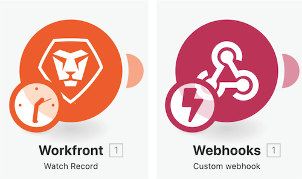
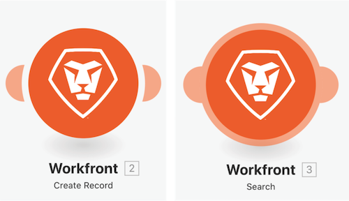

# 이전 버전 액세스 연습

이 비디오에서는 다음 작업을 수행합니다.

* 시나리오를 변경하고 여러 번 저장한 후 이전 버전을 복원하는 방법을 알아봅니다.

## 이전 버전 액세스 연습

Workfront에서는 자체 환경에서 연습을 다시 시도하기 전에 연습 연습 연습 비디오 를 시청하는 것이 좋습니다.

>[!VIDEO](https://video.tv.adobe.com/v/335268/?quality=12)

>[!NOTE]
>
>시나리오를 저장한 후 나중에 액세스해야 하는 경우 3개 점 메뉴 아래에서 새 버전을 사용할 수 있습니다. 이전에 저장한 시나리오 버전은 60일 동안만 사용할 수 있습니다. 감사를 위해 60일 이상의 이전 버전에 액세스해야 하는 경우 Workfront에서는 시나리오의 블루프린트와 보관을 합의된 위치에 저장하는 것이 좋습니다.

>[!TIP]
>
>이 연습을 완료하는 방법에 대한 단계별 지침은 [이전 버전 액세스 연습](https://experienceleague.adobe.com/docs/workfront-learn/tutorials-workfront/fusion/exercises/access-previous-versions.html?lang=en) 운동.

## 용어 추가

### 트리거 모듈

트리거 모듈은 첫 번째 모듈로만 사용할 수 있으며, 0개, 1개 이상의 번들을 반환할 수 있습니다. 집계되지 않는 한 후속 모듈에서 개별적으로 처리됩니다.

**폴링 트리거(트리거 시 시계)**- 마지막으로 처리된 레코드를 추적하는 특수 기능입니다.

**인스턴트 트리거(트리거 시 번개 볼트)**- 웹 후크를 기반으로 즉시 트리거됩니다.

### 작업 및 검색 모듈

**작업**- CRUD(생성, 읽기, 업데이트 및 삭제) 작업을 수행하는 데 사용됩니다.

**검색 결과**- 0개, 1개 이상의 레코드를 검색하고 이를 번들로 반환하는 데 사용되며, 집계되지 않는 한 후속 모듈에서 개별적으로 처리됩니다.

## 자세한 내용 다음 사항을 권장합니다.

[Workfront Fusion 설명서](https://experienceleague.adobe.com/docs/workfront/using/adobe-workfront-fusion/workfront-fusion-2.html?lang=en)
