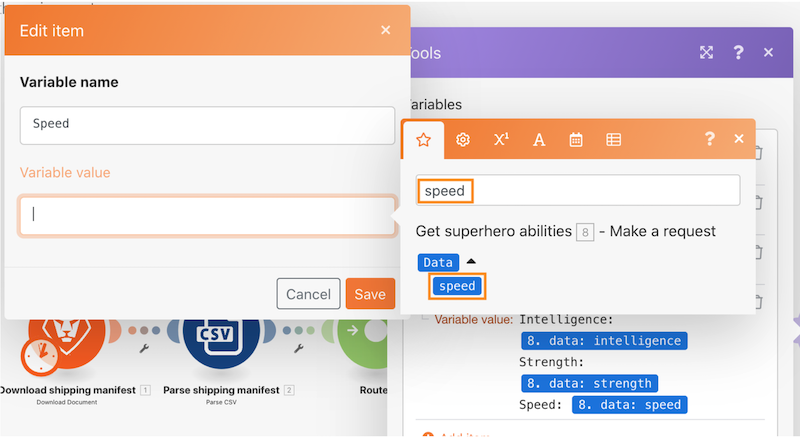

# 라우터 워크스루

라우터를 사용하여 Pokemon 대 슈퍼히어로 번들을 올바른 경로로 전달한 다음 각 캐릭터에 대한 작업을 만듭니다.

## 라우터 워크스루

Workfront에서는 연습 워크스루 비디오를 시청한 다음, 사용자 개인의 환경에서 연습 내용을 재현할 것을 권장합니다.

>[!VIDEO](https://video.tv.adobe.com/v/3416574/?quality=12&learn=on&enablevpops&captions=kor)

## 연습용 URL

* 슈퍼히어로 API 웹 사이트: `https://www.superheroapi.com/`
* 첫 번째 연습용 URL: `https://www.superheroapi.com/api/{access-token}/{character-id}/appearance`
* 두 번째 연습용 URL: `https://www.superheroapi.com/api/{access-token}/{character-id}/powerstats`

자체 슈퍼히어로 토큰에 액세스하는 데 문제가 있는 경우, 다음 공유 토큰(10110256647253588)을 사용할 수 있습니다. 모든 사람에게 공유 토큰이 계속 작동하도록 슈퍼히어로 API에 호출하는 횟수를 고려하십시오.

## 매핑 패널에서 항목 검색

매핑 패널 상단에 있는 검색 항목 필드를 사용하면 배열에 중첩된 경우에도 패널에서 필드를 빠르게 찾을 수 있습니다. 검색은 대소문자를 구분하지 않습니다.

## API 작업을 위한 팁과 요령

지금까지 시나리오에 필요한 정보를 가져오기 위해 추가 인증이 필요하지 않은 매우 간단한 API(애플리케이션 프로그래밍 인터페이스)로 작업했습니다. 다음은 API 및 범용 커넥터 작업을 탐색하는 데 도움이 되는 몇 가지 팁입니다.

## 1단계: API 유형 확인

Workfront 및 많은 소프트웨어 시스템은 오늘날 가장 쉬운 표준 API 유형인 REST(Representational State Transfer) API를 사용하여 빌드됩니다. 그러나 다음과 같은 몇 가지 다른 사항이 있습니다.

* SOAP(Simple Object Access Protocol)(Workfront의 교정쇄 API는 SOAP 기반임)
* FTP(File Transfer Protocol)
* SFTP(Secure File Transfer Protocol)
* 자세히 알아보려면 API 유형 및 관심 키워드에 대한 웹 검색을 수행합니다.

>[!NOTE]
>
>Salesforce와 같은 더 큰 플랫폼에 연결할 때 해당 플랫폼의 서로 다른 영역에서 서로 다른 API를 제공합니다. 연결하려는 서비스에 적합한 서비스를 찾았는지 확인합니다.

## 2단계: API에 필요한 인증 유형 확인

API 인증은 Workfront Fusion을 통해 연결을 시도할 때와 같이 서비스에 대한 액세스를 제어하는 데 사용되는 식별 형식입니다. 시스템에 액세스할 권한이 있음을 다른 시스템에서 증명할 수 있습니다. OAuth 2는 현재 가장 일반적으로 사용되는 인증 유형입니다. 인터넷 검색을 통해 API 인증에 대해 자세히 알아봅니다.

인증은 API 작업에서 가장 어려운 부분일 수 있습니다. Workfront Fusion 범용 커넥터의 가장 중요한 기능 중 하나는 OAuth 2, API 키 등의 기본 인증과 같은 일반적인 인증 방법을 사용할 때 Workfront Fusion으로 인증을 처리할 수 있다는 것입니다. 인증 방법(예: OAuth 2)에 적합한 Workfront Fusion 모듈을 사용하여 연결을 생성하면 시나리오를 실행할 때마다 Workfront Fusion이 계속해서 API 키 및/또는 토큰을 생성합니다.

Experience League의 향상된 인증 개요 문서에서 Workfront가 제공하는 다양한 인증 유형에 대해 알아봅니다.

## 3단계: API 설명서를 읽고 필요한 엔드포인트 찾기

API가 다른 시스템과 상호 작용할 때 이러한 커뮤니케이션의 터치포인트는 엔드포인트로 간주됩니다. 엔드포인트는 API가 요청을 보내고 리소스가 있는 위치입니다.

범용 커넥터를 사용하여 API와 상호 작용할 때 API가 지원하는 엔드포인트 및 각 요청에 필요한 데이터를 이해해야 합니다. API 설명서에는 API 엔드포인트와 만들기, 읽기, 업데이트 또는 삭제 등의 일반적인 작업을 수행하는 방법이 나와 있어야 합니다. 특히 API 호출을 처음 사용하거나 새로운 API로 작업하는 경우, 이러한 호출을 수행하려면 약간의 연습이 필요합니다.

Workfront Fusion 범용 커넥터에 대해 자세히 알아보고 Experience League에서 필요한 API와 연결하도록 설정하는 방법을 알아봅니다.

## 최종 참고 사항

Experience League에서 사전 설치된 앱 커넥터의 전체 목록을 확인할 수 있습니다. Workfront Fusion 제품 팀에 새로운 앱 커넥터를 제안하려면 Innovation Lab에 아이디어를 제출하십시오. 이전에 제출한 적이 없는 경우, Innovation Lab에 대해 자세히 알아보고, 아이디어에 투표하며 연 2회 순위표 우선 순위 지정에 참여하는 방법을 알아봅니다. 이미 Innovation lab에 대한 액세스 권한이 있는 경우, 로그인하여 아이디어를 제출하십시오.

## 사용자 차례

>[!NOTE]
>
>실습 및 과제는 옵션이며 Fusion 교육을 완료하는 데 필수는 아닙니다.

이 실습은 워크스루에서 배운 내용을 기반으로 하나, 해결 방법은 제공되지 않습니다.

Pokemon 캐릭터에 대한 여러 변수 설정 모듈에서 “Stat(Level)”라는 변수를 만듭니다. Pokemon Stats의 이름을 이 변수에 매핑합니다. 배열 값 기능으로 배열이 표시되는 방식을 변경하여 아래와 같이 각 통계가 새 라인이 되도록 합니다.

**힌트:** 해당 수준의 Pokemon 통계는 단 6개입니다.

**과제:** 배열 수식을 사용하여 위와 같은 방식으로 쉼표로 구분된 값 문자열이 아닌 다른 행으로 표시할 수 있는 기능을 사용할 수 있는지 확인합니다. 아래 스크린샷에 힌트가 있습니다.

## 자세히 알아보고 싶으신가요? 다음 자료를 참조하십시오.

[Workfront Fusion 설명서](https://experienceleague.adobe.com/docs/workfront/using/adobe-workfront-fusion/workfront-fusion-2.html?lang=ko-KR)
