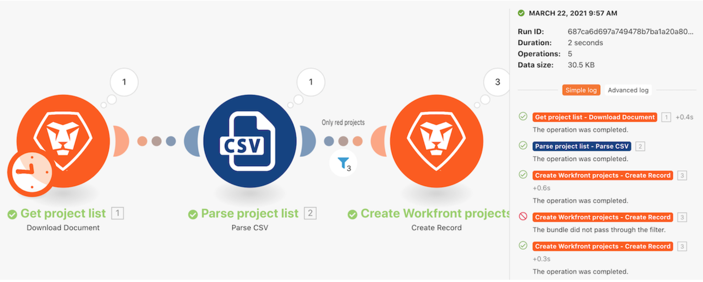

# 실행 기록 워크스루

“강력한 필터 사용” 시나리오에 대한 실행 기록을 검토하여 실행이 발생했을 때 발생한 상황과 실행 시 구성 방식을 이해합니다.

## 실행 기록 워크스루

Workfront에서는 연습 워크스루 비디오를 시청한 다음, 사용자 개인의 환경에서 연습 내용을 재현할 것을 권장합니다.

>[!VIDEO](https://video.tv.adobe.com/v/335283/?quality=12&learn=on)

>[!TIP]
>
>워크스루 연습에 대한 단계별 지침을 보려면 [실행 기록 워크스루](https://experienceleague.adobe.com/docs/workfront-learn/tutorials-workfront/fusion/exercises/execution-history.html?lang=ko) 연습을 참조하십시오.

## 기록 탭에서 전체 텍스트 검색

전체 텍스트 검색은 시나리오의 기록 탭에서 사용할 수 있으며, 시나리오에서 처리된 모든 데이터를 검색할 수 있습니다.

전체 텍스트 검색은 각 실행을 열어 데이터를 검색하는 대신 단일 시나리오 내의 모든 실행에서 검색합니다. 검색 결과는 데이터가 발견된 실행 목록을 제공하며, 실행을 클릭하여 추가로 탐색할 수 있습니다.

검색 결과에는 아래 이미지의 유용한 아이콘이 포함되어 있습니다.

A - 실행 상태입니다.

B - 데이터가 발견된 모듈의 입력 또는 출력에 있는지 여부입니다.

C - 실행 ID입니다.

D - 실행 ID를 복사합니다.

실행을 클릭하면 Workfront Fusion에서 실행 및 검색 결과가 발견된 모듈을 로드합니다. 검색 데이터가 포함된 모듈에서 실행 검사기를 엽니다.

## 자세히 알아보고 싶으신가요? 다음을 권장합니다.

[Workfront Fusion 설명서](https://experienceleague.adobe.com/docs/workfront/using/adobe-workfront-fusion/workfront-fusion-2.html?lang=ko-KR)
