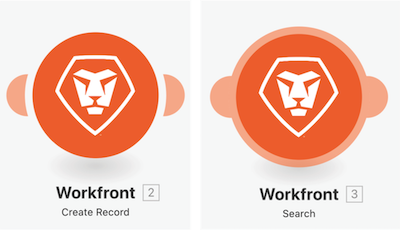

# 추가 앱 및 일반 모듈에 대해 숙지하기

## 모듈 유형에 대한 미리 알림

### 트리거 모듈

첫 번째 모듈로만 사용할 수 있으며, 집계되지 않는 한 후속 모듈에서 개별적으로 처리되는 0개 또는 1개 이상의 번들을 반환할 수 있습니다.

* **인스턴트 트리거**(트리거의 번개 표시) - 웹후크에 따라 즉시 트리거됩니다.
* **예약된 트리거**(트리거의 시계 표시) - 마지막으로 처리된 레코드를 추적하는 특수 기능입니다.

### 작업 및 검색 모듈

* **작업** - CRUD(만들기, 읽기, 업데이트 및 삭제) 작업을 수행하는 데 사용됩니다.
* **검색** - 0개 또는 1개 이상의 레코드를 검색하고, 집계되지 않는 한 후속 모듈에서 개별적으로 처리되는 번들로 반환하는 데 사용됩니다.

### 추가 앱 및 일반 모듈에 대해 숙지하기

이 비디오를 통해 다음과 같은 사항을 알아볼 수 있습니다.

* 트리거, 작업 및 검색의 정의 및 차이점
* 다양한 앱 커넥터에서 발견되는 모듈 유형 및 작동 방식

>[!VIDEO](https://video.tv.adobe.com/v/335287/?quality=12&learn=on)
