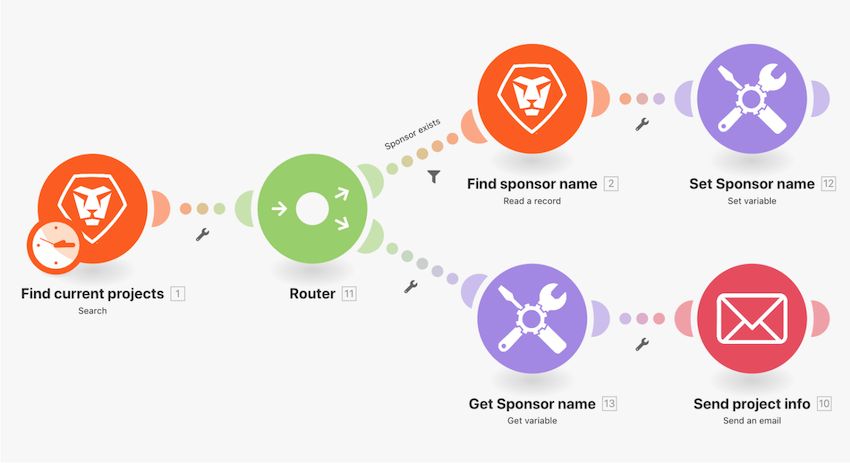

# 전환 함수 워크스루

간단한 데이터 변경의 경우, 전환 함수를 사용하여 모듈 필드 내에서 하나의 값을 다른 값으로 변환합니다. 이 연습에서는 두 글자로 된 키를 이메일로 전송된 프로젝트 ‘진행 상태’의 실제 이름으로 변경합니다.

## 전환 함수 워크스루

Workfront에서는 연습 워크스루 비디오를 시청한 다음, 사용자 개인의 환경에서 연습 내용을 재현할 것을 권장합니다.

>[!VIDEO](https://video.tv.adobe.com/v/3417452/?captions=kor&quality=12&learn=on&enablevpops=1)

## 자세히 알아보고자 하십니까? 다음 자료를 참조하십시오.

[Workfront Fusion 설명서](https://experienceleague.adobe.com/ko/docs/workfront-fusion/using/get-started-with-fusion/understand-workfront-fusion/workfront-fusion-overview)
