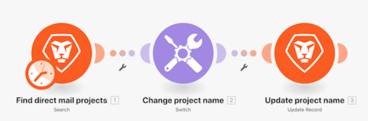

# 전환 모듈 워크스루

더 복잡하거나 동적인 데이터 변환을 수행해야 하는 경우, 전환 모듈을 사용하는 방법을 이해합니다.

## 전환 모듈 워크스루

Workfront에서는 연습 워크스루 비디오를 시청한 다음, 사용자 개인의 환경에서 연습 내용을 재현할 것을 권장합니다.

>[!VIDEO](https://video.tv.adobe.com/v/335290/?quality=12&learn=on&enablevpops=1)

## 자세히 알아보고자 하십니까? 다음 자료를 참조하십시오.

[Workfront Fusion 설명서](https://experienceleague.adobe.com/ko/docs/workfront-fusion/using/get-started-with-fusion/understand-workfront-fusion/workfront-fusion-overview)
