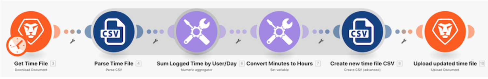

# 데이터 구조 연습

## 개요

시간 항목 목록이 포함된 CSV 파일을 엽니다. 이 시간 항목은 여러 사용자가 특정 일 동안 로그인한 시간(분)입니다. 목표는 이 정보를 가져와서 각 사용자가 매일 로그인한 총 시간(시간)을 표시하는 새 CSV를 만드는 것입니다.

## 데이터 구조 연습

Workfront에서는 자체 환경에서 연습을 다시 시도하기 전에 연습 연습 연습 비디오 를 시청하는 것이 좋습니다.

>[!VIDEO](https://video.tv.adobe.com/v/335294/?quality=12)

>[!TIP]
>
>이 연습을 완료하는 방법에 대한 단계별 지침은 [데이터 구조 연습](https://experienceleague.adobe.com/docs/workfront-learn/tutorials-workfront/fusion/exercises/data-structures.html?lang=en) 운동.

## 자세한 내용 다음 사항을 권장합니다.

[Workfront Fusion 설명서](https://experienceleague.adobe.com/docs/workfront/using/adobe-workfront-fusion/workfront-fusion-2.html?lang=en)
