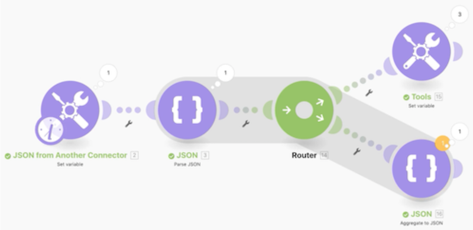

# JSON 작업 워크스루

디자인 요구 사항을 지원하도록 시나리오 내에서 JSON을 만들고 구문 분석하는 방법을 알아봅니다.

## 배열 워크스루

Workfront에서는 연습 워크스루 비디오를 시청한 다음, 사용자 개인의 환경에서 연습 내용을 재현할 것을 권장합니다.

이 비디오에서는 다음 방법을 배우게 됩니다.

* 디자인 요구 사항을 지원하도록 시나리오 내에서 JSON을 만들고 구문 분석

>[!VIDEO](https://video.tv.adobe.com/v/335301/?quality=12&learn=on&enablevpops=1)

## 자세히 알아보고자 하십니까? 다음 자료를 참조하십시오.

[Workfront Fusion 설명서](https://experienceleague.adobe.com/en/docs/workfront-fusion/using/get-started-with-fusion/understand-workfront-fusion/workfront-fusion-overview)
