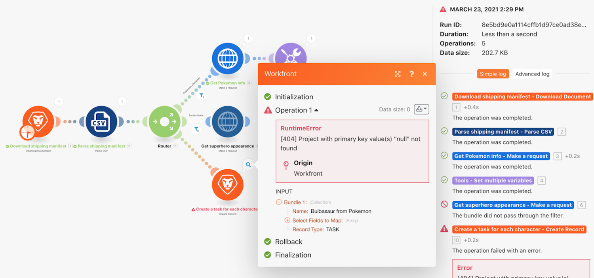

# 오류 처리 연습

## 개요

기본 오류 처리가 발생하는 방식과 지시어를 사용하여 특정 모듈 오류 처리를 추가하는 방법을 이해합니다.

## 오류 처리 연습

Workfront에서는 자체 환경에서 연습을 다시 시도하기 전에 연습 연습 연습 비디오 를 시청하는 것이 좋습니다.

>[!VIDEO](https://video.tv.adobe.com/v/335306/?quality=12)

## 자세한 내용 다음 사항을 권장합니다.

[Workfront Fusion 설명서](https://experienceleague.adobe.com/docs/workfront/using/adobe-workfront-fusion/workfront-fusion-2.html?lang=en)
