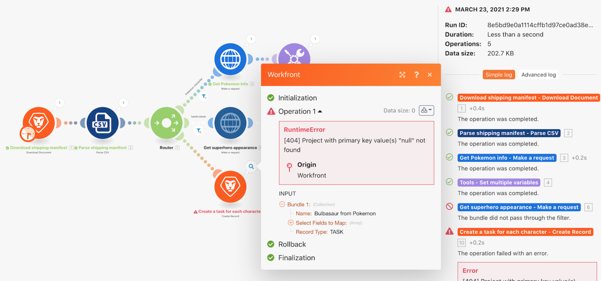

# 오류 처리 워크스루

기본 오류 처리가 발생하는 방식과 지시문을 사용하여 특정 모듈 오류 처리를 추가하는 방법을 이해합니다.

## 오류 처리 워크스루

Workfront에서는 연습 워크스루 비디오를 시청한 다음, 사용자 개인의 환경에서 연습 내용을 재현할 것을 권장합니다.

>[!VIDEO](https://video.tv.adobe.com/v/335306/?quality=12&learn=on&enablevpops=1)

## 자세히 알아보고자 하십니까? 다음 자료를 참조하십시오.

[Workfront Fusion 설명서](https://experienceleague.adobe.com/ko/docs/workfront-fusion/using/get-started-with-fusion/understand-workfront-fusion/workfront-fusion-overview)
