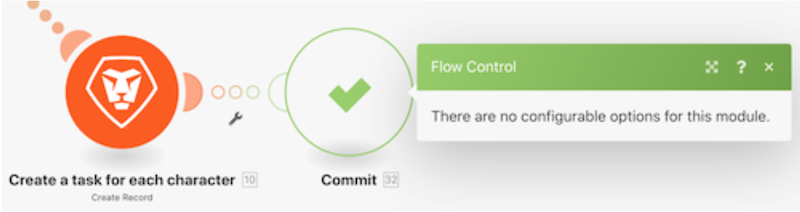

# 오류 처리 지시 이해

이 비디오에서는 다음을 학습합니다.

* 실행을 계속할 수 있는 세 개의 오류 처리기 지시문입니다
* 실행을 중지하는 두 오류 처리기 지시문

>[!VIDEO](https://video.tv.adobe.com/v/335305/?quality=12)

## 지시 — 시나리오 지속

### 다시 시작

* 대체 출력이 지정되고 오류가 발생하는 모듈에 제공됩니다.
* 후속 모듈이 처리됩니다.
* 시나리오 실행 상태는 &quot;성공&quot;으로 표시됩니다.

### 브레이크

* 시나리오 실행 상태는 오류를 수동으로 해결할 수 있는 불완전한 실행 큐에 저장됩니다. 그러나 여기에 언급된 몇 가지 예외가 있습니다.
* 후속 모듈이 처리되지 않습니다.
* 처리되지 않은 번들이 있으면 시나리오 실행이 정상적으로 계속 실행됩니다.
* 시나리오 실행 상태는 &quot;경고&quot;로 표시됩니다.

### 무시

* 오류가 무시되고 후속 모듈이 처리되지 않습니다.
* 처리되지 않은 번들이 있으면 시나리오 실행이 정상적으로 계속 실행됩니다.
* 시나리오 실행 상태는 &quot;성공&quot;으로 표시됩니다.

## 지시어 — 시나리오 정지

### 롤백

* 시나리오 실행이 즉시 중지되고 모든 모듈에서 롤백 단계가 시작되어 초기 상태로 모두 되돌릴 수 있습니다.
* 후속 모듈이 처리되지 않습니다.
* 몇 가지 오류 유형이 없는 경우 시나리오 설정에서 지정된 &quot;연속 오류 수&quot; 후에 시나리오가 비활성화됩니다.
* 시나리오 실행 상태는 &quot;error&quot;로 표시됩니다.

>[!NOTE]
>
>모듈에 연결된 오류 처리기 경로가 없고 시나리오 설정의 &quot;완료되지 않은 실행 저장 허용&quot; 설정이 선택되어 있지 않은 경우 이 동작이 기본 동작입니다.

### 커밋

* 오류가 무시되고 후속 모듈이 처리되지 않습니다.
* 처리되지 않은 번들이 있으면 시나리오 실행이 정상적으로 계속 실행됩니다.
* 시나리오 실행 상태는 &quot;성공&quot;으로 표시됩니다.

