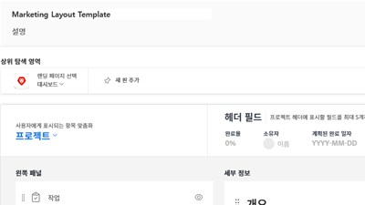
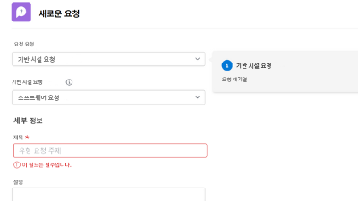
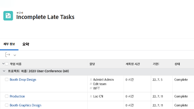

# Workfront 튜토리얼 {#overview}

Workfront 기능 및 설정을 더 잘 이해할 수 있도록 설계된 교육 비디오 및 문서 라이브러리입니다.  사용자와 사용자 조직이 Workfront를 성공적으로 사용하도록 도움이 되는 모범 사례, 선별된 연습 및 기타 리소스 컬렉션이 포함되어 있습니다.

>[!VIDEO](https://video.tv.adobe.com/v/335063/?quality=12&learn=on)

<!-- 

This is the landing page of the user guide. It should be the first list item in the TOC.md file. 
See other user landing pages to get ideas. 

-->

## 직원 추천

<table style="margin-top: 0 !important">
  <tr>
   <td>
      
      

         <a href="/help/administration-and-setup/layout-templates/find-layout-templates.md"><strong>레이아웃 템플릿 찾기 및 만들기</strong></a>
      

      

         <em>기본 레이아웃 템플릿을 만드는 방법을 알아보십시오.</em>
      

    </td>
   <td>
      
      

         <a href="/help/manage-work/issues-requests/make-a-request.md"><strong>요청하기</strong></a>
      

      

         <em>요청을 하고, 보고, 편집하는 방법을 알아보십시오.</em>
      

<td>
      
      

         <a href="/help/reporting/basic-reporting/create-a-simple-report.md"><strong>간단한 보고서 만들기</strong></a>
      

      

         <em>간단한 사용자 정의 보고서를 만드는 방법에 대해 알아봅니다.</em>
      

    </td>
  </tr>
</table>

