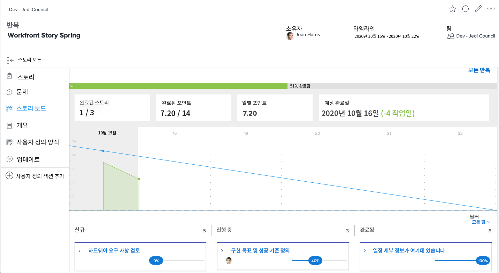
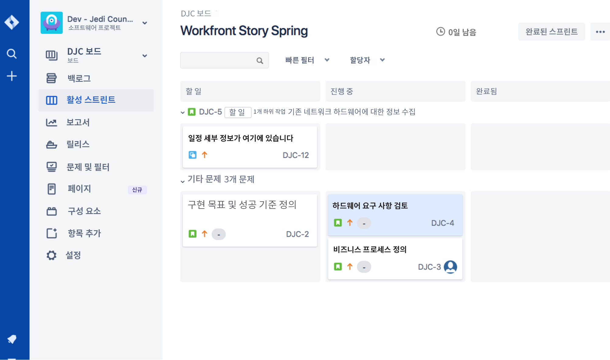
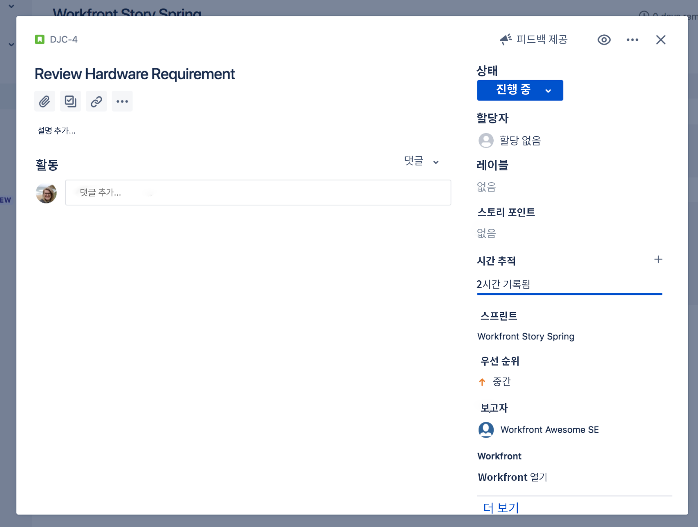
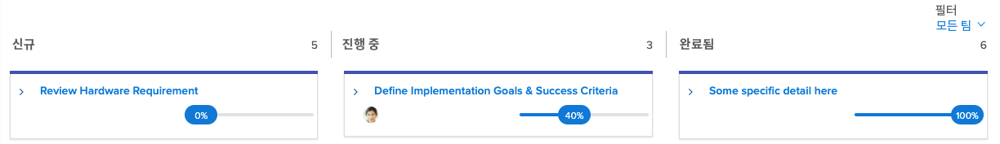

# 를 사용하여 가시성 만들기 [!DNL Jira] 통합

[!DNL Jira]  는 개발 및 기술 지원 팀에 대한 프로젝트 및 문제를 추적하는 데 사용되는 제품입니다. 많은 팀이 Jira를 사용하여 작업 수준 진행 상황을 추적하는 동안, [!DNL Workfront] 높은 수준의 진행률 보기를 얻을 수 있으므로 진정한 프로젝트 관리를 수행할 수 있습니다. 사용 [!DNL Jira]  네이티브 통합, 이 정보는 두 애플리케이션 간에 자동으로 전송될 수 있습니다.

## 정의 [!DNL Jira] ?

[!DNL Jira]  는 에서 만든 제품입니다 [!DNL Atlassian] 개발 및 기술 지원 팀에 대한 프로젝트 및 문제를 추적하려면 다음을 수행하십시오. 많은 팀이 [!DNL Jira]  작업 수준 진행 상태를 추적하지만 [!DNL Workfront] 프로젝트를 관리하려면 즉, 팀이 두 작업 모두에서 작업을 만들어 노력을 두 배로 늘립니다 [!DNL Workfront] 및 [!DNL Jira] . 아직 [!DNL Jira]  네이티브 통합. 이러한 종류의 정보는 두 애플리케이션 간에 자동으로 전송될 수 있습니다.

## 다음을 수행할 수 있습니다. [!DNL Jira]  통합?

여기 스프린트가 있습니다 [!DNL Workfront] 제목 &quot;[!DNL Workfront] &quot;이야기 봄.&quot;

개발-제다이 위원회 애자일 팀 리더인 Joan Harris는 전체 스프린트의 진행 상황을 측정하기 위한 방법으로 스크럼보드 및 번다운 차트를 사용합니다. 그것은 그 팀에게 진행 상황을 시각적으로 잘 보여줍니다. 또한, 이 정보는 분기별로 검토되는 경영진 보고서에 투입되고 있습니다. 하지만 대부분의 팀에서는 [!DNL Jira] , 아님 [!DNL Workfront].

조앤의 팀이 [!DNL Jira]  몇 년 동안 작업하도록 지정된 개별 작업 및/또는 버그를 추적하는 것이 좋습니다. 하지만 조앤은 정말로 그 정보가 [!DNL Workfront] 그리고, 궁극적으로, 이러한 경영진 보고서를 제공합니다.

사용 [!DNL Jira]  기본 통합, 작업, 스토리 또는 버그에 대한 모든 업데이트는 [!DNL Workfront].

따라서 Review Hardware Requirements Story에 할당된 팀 구성원이 의 상태를 업데이트할 때 [!DNL Jira] 를 &quot;새로 만들기&quot;에서 &quot;진행 중&quot;으로 이동하면 업데이트로 스토리의 상태가 자동으로 변경됩니다 [!DNL Workfront] 또한.

