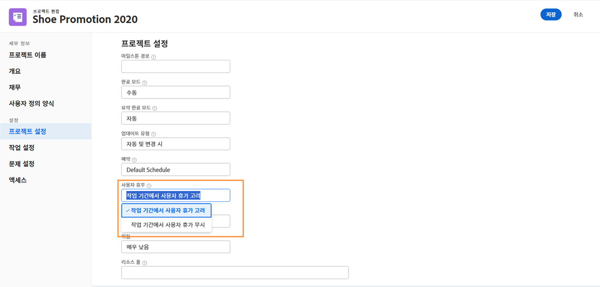
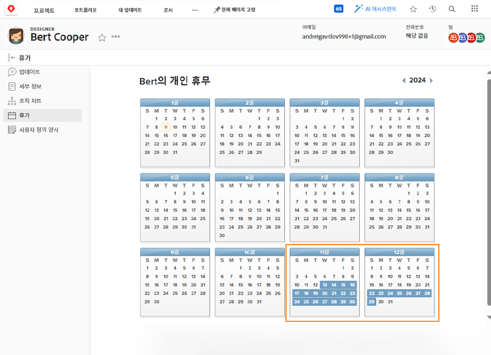
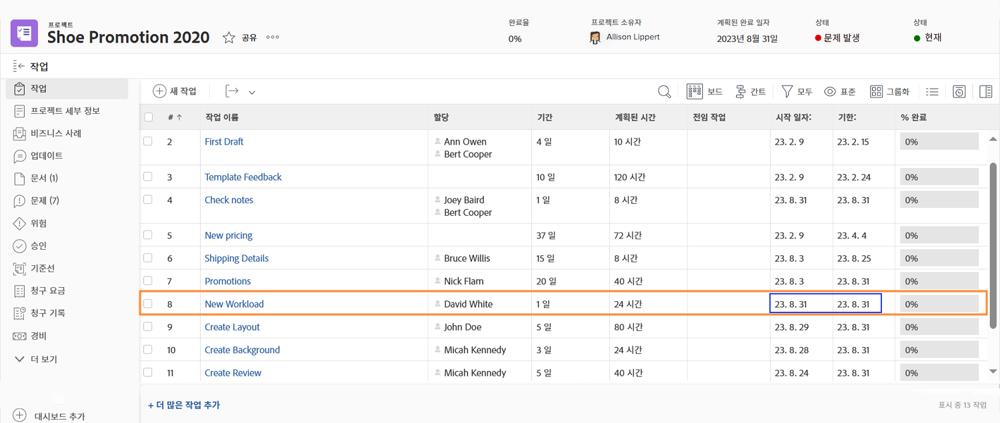
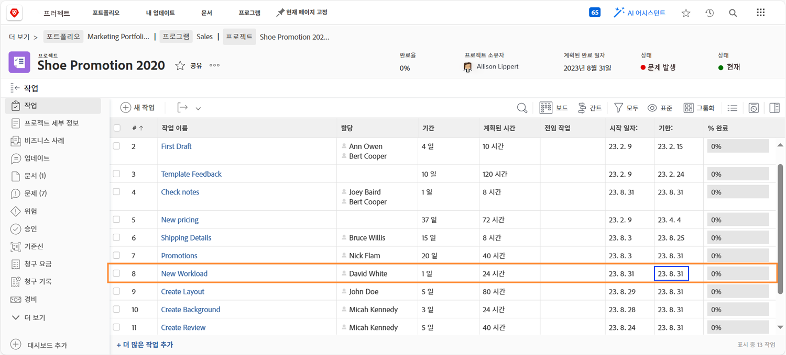
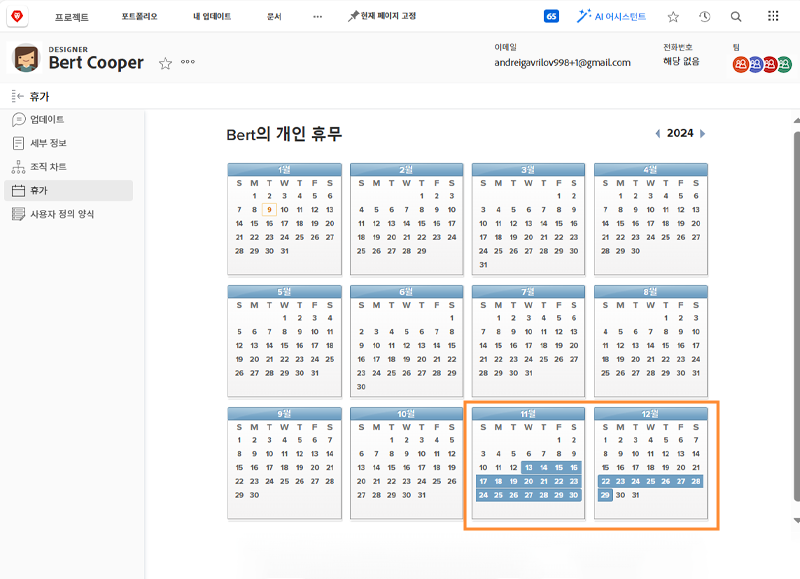
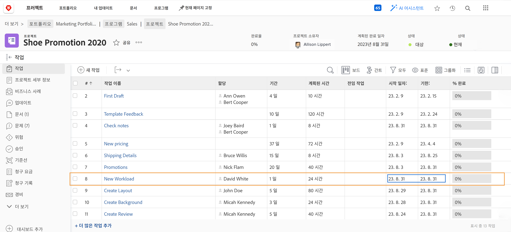
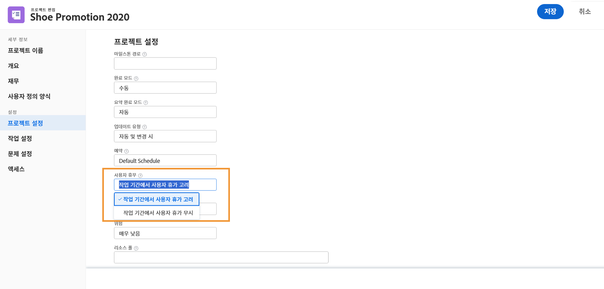

# 프로젝트 타임라인에 미치는 시간

지정된 사용자의 시간 초과 요소가 프로젝트 타임라인에 포함되는지 여부는 프로젝트 설정에 따라 달라집니다 [!UICONTROL 사용자 해제 시간]. 이 설정은 태스크의 기본 담당자에 대한 시간이 프로젝트에서 해당 태스크에 대한 계획 일자를 조정하는지 여부를 결정합니다.

각 설정을 선택할 때 프로젝트 타임라인에서 어떤 작업이 수행되는지 살펴보겠습니다. C[!UICONTROL 작업 기간의 사용자 시간 초과 고려] 또는 [!UICONTROL 작업 기간의 사용자 시간 초과 무시].

## 작업 기간에서 사용자 휴가 고려

이 옵션은 Workfront의 기본 설정입니다.

이 예에서, 작업의 기본 할당자는 개인 달력에 표시된 휴일이 있습니다.

프로젝트 관리자가 이 사람을 사용자의 휴가와 겹치는 계획 날짜가 있는 작업에 할당하려고 합니다.

이 사용자가 작업에 지정되면 계획 날짜가 자동으로 조정됩니다. 이제 작업 완료 예정 날짜가 사용자의 휴가 시간을 수용하도록 며칠 연장되었습니다. 이 변경 사항은 프로젝트의 다른 작업의 계획 날짜에 영향을 줄 수 있으며, 프로젝트의 계획 완료 날짜에 영향을 줄 수 있습니다.

## [!UICONTROL 작업 기간에서 사용자 휴가 무시]

이 옵션을 사용하면 1차 할당자가 해당 작업 기간 동안 휴가가 되어도 작업의 계획 날짜는 원래 계획된 상태로 유지됩니다.

팀 구성원이 일정에 표시된 휴일이 있습니다.

프로젝트 관리자는 해당 시간과 겹치는 작업을 지정합니다. 사용자가 할당되면 작업 계획 날짜는 원래 계획 상태로 유지됩니다.

작업이 제시간에 이루어지도록 하기 위해 원래 할당자가 부재 중에 작업을 수행할 수 있는 다른 사람을 할당하는 것이 도움이 될 수 있습니다.

## 프로젝트 수준에서 설정 조정

프로젝트에서 사용자 시간 초과 설정을 변경하려면 다음을 수행하십시오.

* Workfront에서 해당 이름을 클릭하여 프로젝트를 엽니다.

* 선택 [!UICONTROL 편집] 페이지 헤더의 3점 메뉴에서 프로젝트 이름의 오른쪽에 있습니다.

* 로 스크롤합니다. [!UICONTROL 프로젝트 설정] 섹션을 찾아 [!UICONTROL 사용자 해제 시간] 필드.

* 이 프로젝트에 적용할 옵션을 선택합니다. [!UICONTROL 작업 기간의 사용자 시간 비우기 고려] 또는[!UICONTROL 작업 기간의 사용자 시간 초과 정보].

* 을(를) 클릭합니다. [!UICONTROL 저장] 창의 오른쪽 위 모서리에 있는 버튼.

**참고**: 이 설정은 [!UICONTROL 프로젝트 세부 사항] 프로젝트 페이지의 왼쪽 패널 메뉴에서 를 클릭합니다.

이에 대한 전역 설정은 [!UICONTROL 설정] 메뉴 아래의 제품에서 사용할 수 있습니다. 이 설정은 시스템 관리자가 관리합니다. 그룹 관리자는 관리하는 그룹에 대해 이 설정을 조정할 수 있습니다.

Workfront에서는 대부분의 프로젝트가 조직에서 시간을 보낼 수 있도록 설정하는 방법을 권장합니다.

템플릿 세부 사항을 통해 프로젝트 템플릿에 설정을 작성할 수도 있습니다.
