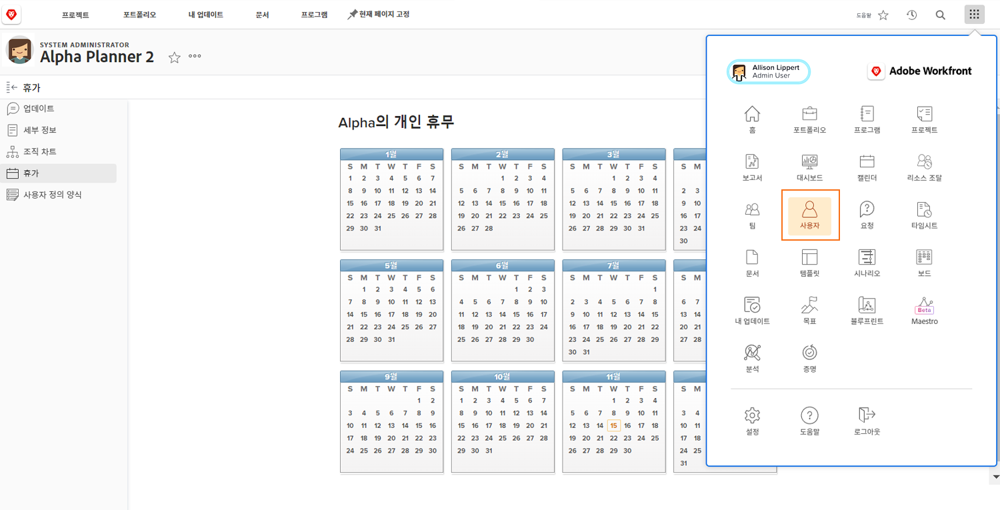

# 다른 사용자의 휴무 관리

관리자 또는 다른 리더는 Workfront 액세스 권한 수준을 통해 할당된 사용자 편집 권한이 있는 경우 팀원의 휴무 캘린더를 관리할 수 있습니다. 액세스 권한 수준은 Workfront 시스템 관리자가 만들고 할당합니다.

Workfront에서는 관리자가 직원의 개인 휴무 캘린더를 업데이트할 때를 위한 정책 또는 절차를 조직에 마련할 것을 권장합니다.

다른 사용자의 캘린더를 관리하려면 다음 작업을 수행하십시오.

* [!UICONTROL 메인 메뉴]를 클릭하고 ‘사용자’를 선택합니다.

* 검색 아이콘을 사용하여 사용자를 찾거나 목록을 스크롤합니다.

* 목록에서 사용자 이름을 클릭합니다.

* 사용자 프로필 페이지의 왼쪽 패널 메뉴에서 [!UICONTROL 휴무]를 클릭합니다.

* 캘린더에서 일자를 클릭합니다.

* Workfront에서는 기본적으로 종일 휴무로 가정합니다. 종일 휴무가 맞는 경우 계속해서 [!UICONTROL 저장] 버튼을 클릭합니다.

* 연속으로 여러 날 휴무인 경우 종료 일자를 마지막 부재일로 변경합니다. [!UICONTROL 저장] 버튼을 클릭합니다.

* 부분 휴무일을 표시하려면 [!UICONTROL 하루 종일] 상자를 선택 해제합니다. 그런 다음 사용자가 그날 일하는 시간(근무 시간)을 표시합니다. [!UICONTROL 저장] 버튼을 클릭합니다.
