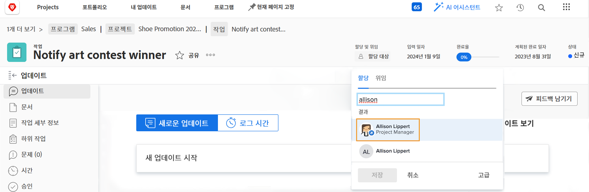

# 작업 할당 시 휴무 확인

작은 아이콘은 사용자 할당 시 작업 기간 동안 사용자의 개인 일정에 휴무가 표시되어 있음을 나타냅니다.

사용자 이름을 입력하여 프로젝트 계획에서 할당할 때 이름이 회색으로 표시되고 아바타 사진 옆에 작은 파란색 경고 아이콘이 표시됩니다.

작업 페이지 머리글에서 할당하는 경우, 사람 아바타 옆에 작은 파란색 비행기 아이콘이 표시되어 이 작업을 수행하는 동안 휴무가 있음을 알립니다.

