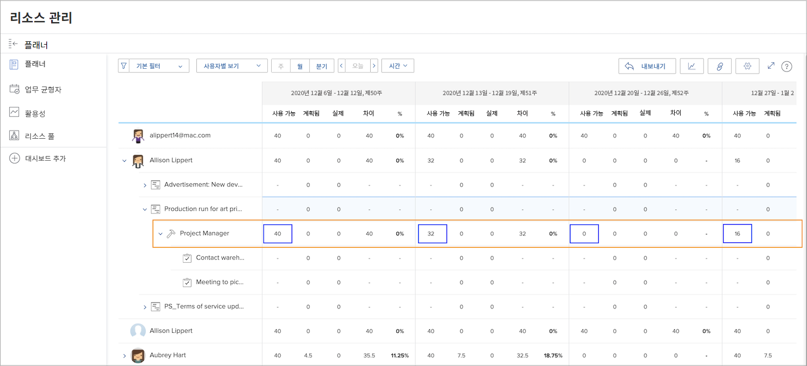
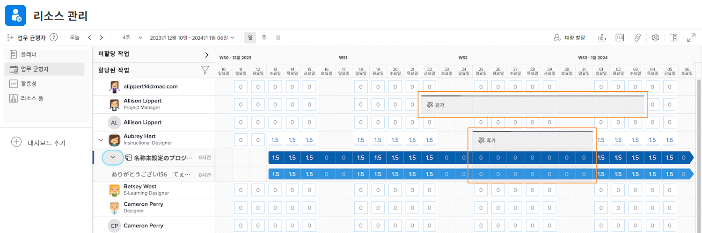

# 리소스 관리 툴의 가시성

자원 계획 및 관리에 있어 누가 언제 사용할 수 있는지 파악합니다. 사용자가 Workfront의 달력에 개인 휴무를 표시하면 해당 정보가 Workfront의 리소스 도구에서도 표시됩니다.

## 리소스 플래너

사용자의 휴무는 리소스 플래너의 사용 가능(AVL) 열에 반영됩니다. Workfront은 할당된 일정, 작업 역할 백분율 등을 기반으로 Workfront에서 계산한 대로 사용 가능한 시간에서 달력에 표시된 휴무를 뺍니다.

## 워크로드 밸런서

업무 균형자에서 휴무는 캘린더에 회색 막대로 표시됩니다. 이러한 가시성은 작업을 할당할 때 리소스 관리자 및 기타 사용자가 보다 정보에 입각한 결정을 내리는 데 도움이 됩니다.

그러나 휴무 표시기로 인해 업무 균형자를 통해 사용자에게 작업이 할당되지 않는 것은 아닙니다. 작업이 할당된 경우 업무 균형자에 휴무 기간 동안 초과 할당된 사용자가 표시됩니다.

