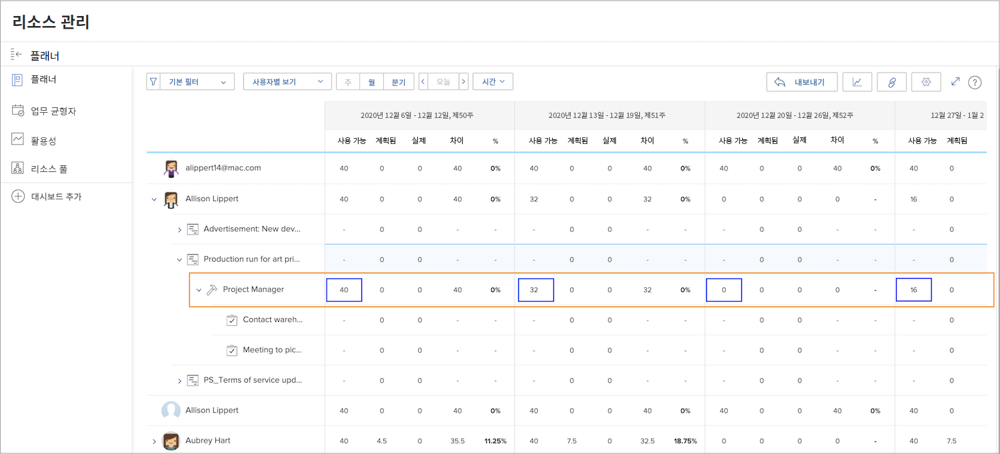
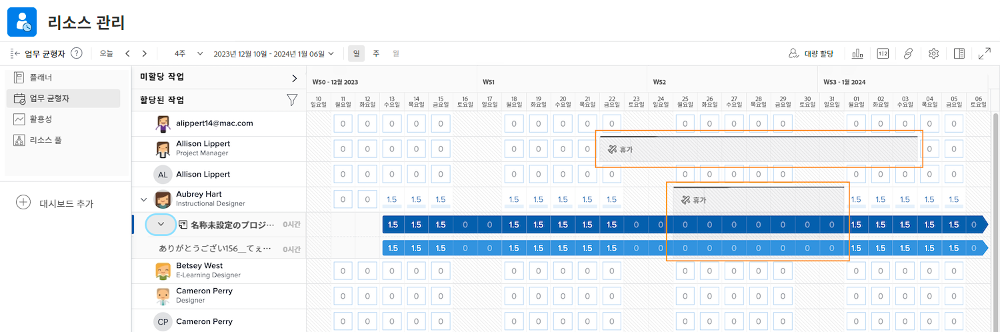

# 리소스 관리 도구의 가시성

사용 가능한 사람과 시간을 아는 것은 리소스 계획 및 관리에 매우 중요합니다. 사용자가 Workfront의 캘린더에 개인 휴무를 표시하면 Workfront의 리소스 도구에서도 해당 정보를 조회할 수 있습니다.

## 리소스 플래너

사용자의 휴무는 리소스 플래너의 사용 가능한(AVL) 열에 반영됩니다. Workfront는 할당된 일정, 작업 역할 백분율 등에 따라 Workfront에서 계산한 대로 사용 가능한 시간에서 캘린더에 표시된 휴무를 뺍니다.

## 워크로드 밸런서

워크로드 밸런서에서 휴무는 캘린더에 회색 막대로 표시됩니다. 이러한 가시성을 통해 리소스 관리자와 다른 사람들은 작업을 할당할 때 더 많은 정보에 입각한 결정을 내릴 수 있습니다.

단, 휴무 표시기는 워크로드 밸런서를 통해 사용자에게 작업이 할당되는 것을 방지하지 않습니다. 작업이 할당된 경우, 워크로드 밸런서는 해당 사람이 휴무 기간 동안 초과 할당되었다고 표시합니다.

