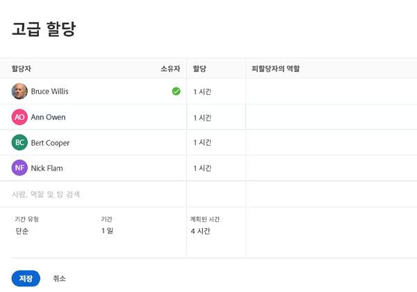
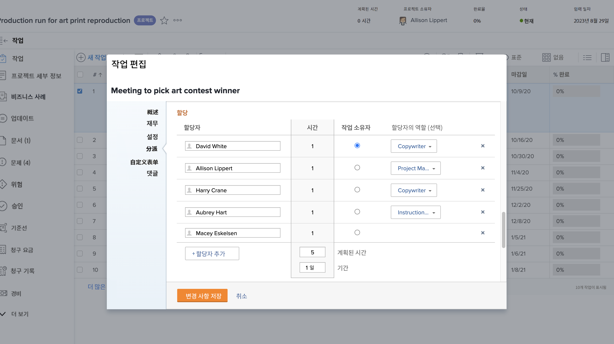

# 기본 할당자는 무엇입니까?

작업에 두 명 이상의 사용자가 할당되면 기본 할당자가 존재합니다. 기본 할당자의 일정 시간은 사용자 시간 제한 설정을 적용할 때 Workfront이 보는 것입니다.

프로젝트 페이지에서 기본 할당자가 누구인지 확인합니다. 지정 필드를 클릭한 다음, 모서리에서 고급 지정 아이콘을 클릭합니다.

Advanced Assignments 창에서 1차 할당자 또는 태스크 소유자가 녹색 확인 표시를 사용하여 지정됩니다. 다른 사용자를 마우스로 가리킨 다음 기본 만들기 링크를 클릭하여 작업 소유자를 변경합니다.

작업 페이지에서 기본 할당자를 조정할 수도 있습니다. 프로젝트 목록의 작업에 대한 상자를 선택한 다음 편집 아이콘을 클릭합니다. 지정 섹션으로 스크롤하고 버튼을 클릭하여 작업 소유자를 지정합니다.

