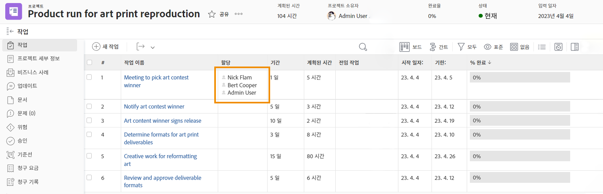
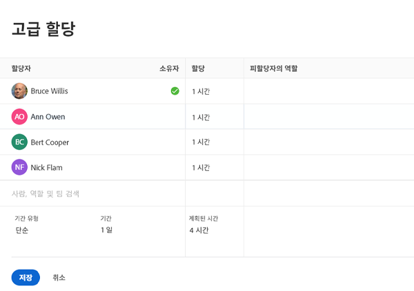
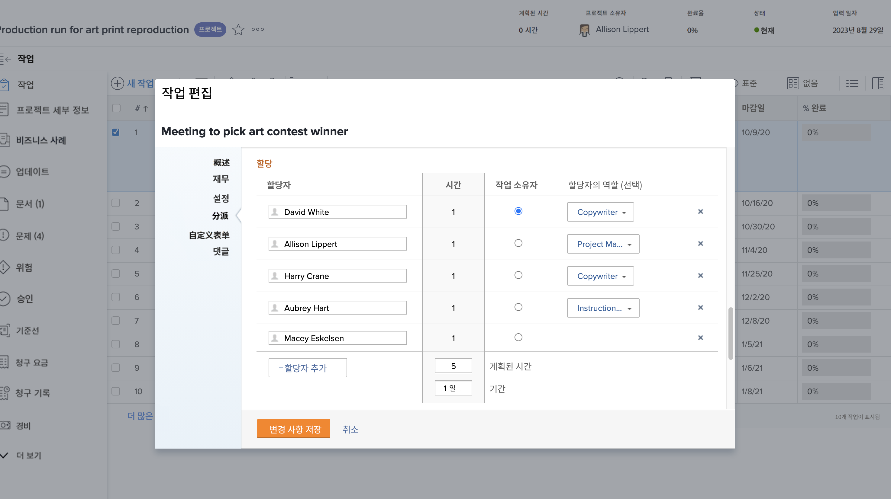

# 기본 할당자란 무엇입니까?

두 명 이상의 사용자가 작업에 할당된 경우 기본 할당자가 존재합니다. 기본 할당자의 휴무 캘린더는 사용자 휴무 설정을 적용할 때 Workfront에서 확인하는 항목입니다.

프로젝트 페이지에서 기본 할당자를 찾습니다. 할당 필드를 클릭한 다음, 모서리에 있는 고급 할당 아이콘을 클릭합니다.

고급 할당 창에서 기본 할당자 또는 작업 소유자는 녹색 확인 표시로 지정됩니다. 다른 사용자 위에 마우스 커서를 놓고 기본 만들기 링크를 클릭하여 작업 소유자를 변경합니다.

작업 페이지에서 기본 할당자를 조정할 수도 있습니다. 프로젝트 목록에서 작업 상자를 선택한 다음, 편집 아이콘을 클릭합니다. 할당 섹션으로 스크롤하고 버튼을 클릭하여 작업 소유자를 지정합니다.

