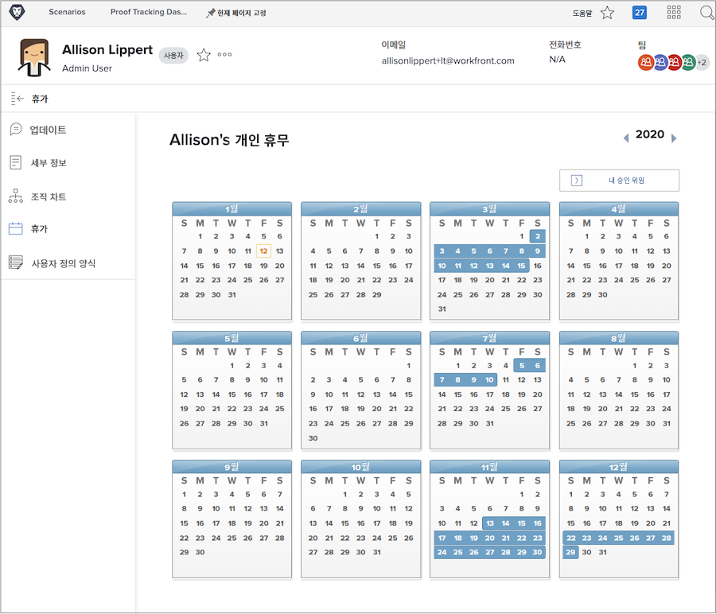
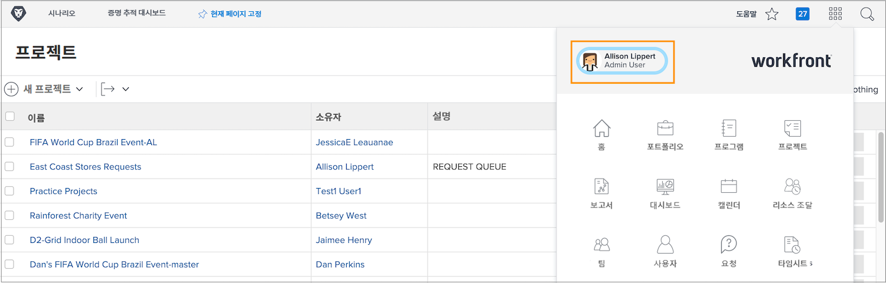
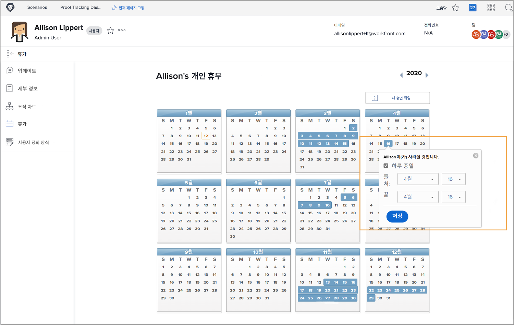

# 휴무 캘린더를 사용하는 이유는 무엇입니까?

플래너와 프로젝트 관리자가 Workfront에서 작업을 할당할 때 할당된 작업을 완료할 수 있는 팀원을 알면 정시에 프로젝트를 완료할 수 있습니다.

리소스 관리자가 Workfront의 리소스 계획 및 관리 도구에서 할당을 검토할 때 정확한 가용성 데이터가 현재 및 미래의 작업 계획에도 적용됩니다.

Workfront 작업 및 계획 라이선스 사용자는 개인 휴무 캘린더를 사용하여 일반적인 작업 시간 동안 사용할 수 없는 시간을 표시할 수 있습니다. 반나절의 휴무라도 할당된 작업 완료에 영향을 미칠 수 있습니다.

**메모**: Workfront는 개인 휴무를 관리, 누적 또는 추적하기 위해 조직의 기존 시스템을 복제하거나 교체하도록 고안되지 않았습니다. 휴무 요청 및 관리에 대한 조직의 지침을 따르십시오.

## 휴무 표시

개인 휴무 캘린더는 메인 메뉴에서 액세스할 수 있는 Workfront의 사용자 페이지에 있습니다. 왼쪽 모서리에서 이름을 클릭합니다.

* Workfront 사용자 페이지의 왼쪽 패널 메뉴에서 휴무를 클릭합니다.

* 기본적으로 현재 연도가 표시됩니다. 필요한 경우, 화살표를 사용하여 다른 연도를 선택합니다(캘린더 창의 오른쪽 상단).

* 캘린더에서 일자를 클릭합니다.

* Workfront는 종일 휴무를 보낸다고 가정합니다. 종일 휴무가 맞는 경우, 계속해서 저장 버튼을 클릭합니다.

* 연속으로 종일 휴무를 내는 경우, 종료 일자를 마지막 부재일로 변경합니다. 저장 버튼을 클릭합니다.

* 종일 휴무가 아니라면 하루 종일 상자의 선택을 취소합니다. 그런 다음 그날 일할 시간(가능한 시간)을 표시합니다. 저장 버튼을 클릭합니다.

휴무는 캘린더의 파란색 상자로 표시됩니다. 이 휴무는 프로젝트 및 리소스 계획을 지원하도록 Workfront의 다른 위치에도 표시됩니다.

**Pro 팁**: 작업이 이미 할당된 경우, 캘린더에 휴무를 표시하면 프로젝트 관리자에게 작업이 불가능함을 알리는 알림이 전송되지 않습니다. 현재 프로젝트나 할당된 작업에 영향을 줄 수 있는 새로운 휴무가 있으면 프로젝트 관리자를 업데이트해야 합니다.
