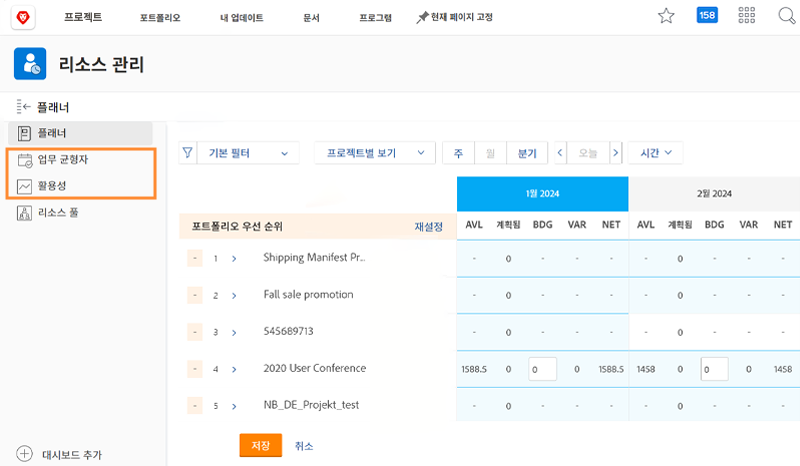

# 리소스 관리 설정, 워크로드 밸런서 및 활용성 보고서

[!DNL Workfront]는 [!DNL Workfront]의 여러 도구에 데이터를 제공하여 리소스 결정을 보다 쉽고 원활하게 수행할 수 있습니다. 리소스의 진행 상황을 확인하려면 관리자, 사용자 및 프로젝트가 올바르게 구성되었는지 확인해야 합니다. 이러한 구성은 모든 [!DNL Workfront’s] 리소스 관리 도구를 사용할 계획이 없는 경우에도 유용합니다.

이 섹션에서는 다음을 배웁니다.

* 적절한 액세스로 리소스 관리자를 설정하는 방법
* 워크로드 밸런서 및 활용성 보고서를 보는 방법

## 리소스 관리 설정

적절한 사용자가 조직 리소스에 액세스하고 관리할 수 있는지 확인하는 것부터 시작하겠습니다.

&lt;!단계별 지침 안내서를 다운로드합니다.&gt;

## 워크로드 밸런서 및 활용성 보고서

액세스 수준에서 편집 권한이 부여된 경우 사용자는 리소스 플래너 및 리소스 풀과 함께 워크로드 밸런서 및 활용률 보고서와 같은 추가 도구에 액세스할 수 있습니다.

이러한 도구를 통해 리소스에 액세스하거나 리소스를 관리하는 데 다른 설정은 필요하지 않습니다.

