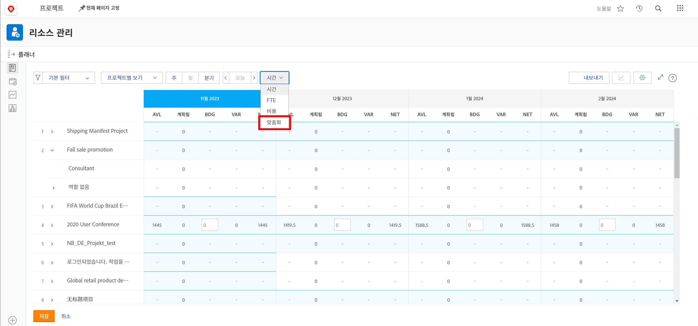
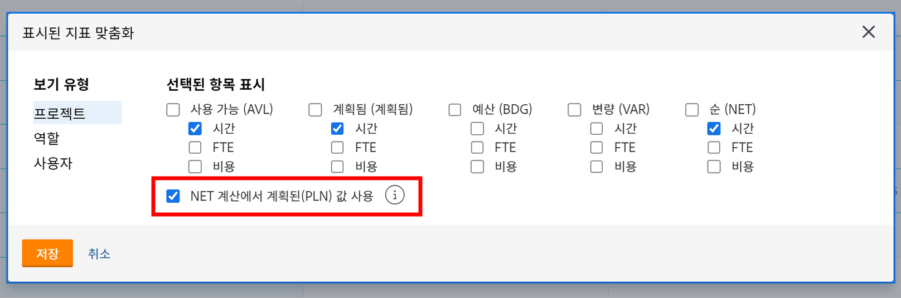
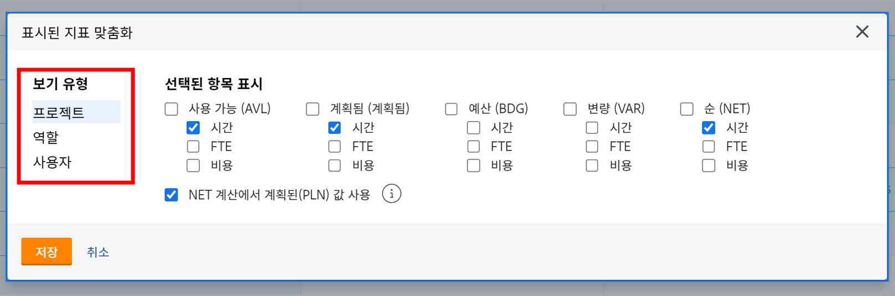
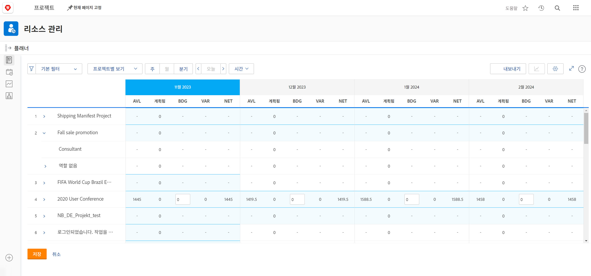

# 에서 작업 역할별로 보기 [!DNL Resource Planner]

이 비디오에서는 다음 작업을 수행합니다.

* 다음을 참조하십시오 [!UICONTROL 작업 역할별 보기 ]보기
* 리소스 정보가 이 보기에 표시되는 방법을 알아봅니다.

>[!VIDEO](https://video.tv.adobe.com/v/335169/?quality=12)

작업 역할별 보기 옵션의 경우 기본적으로 예산 열이 표시되어 프로젝트에 필요한 예상 리소스 수가 채워진 경우 해당 비즈니스 사례에서 해당 리소스 수를 가져옵니다. 또한 기본적으로 순 열은 예산 열의 숫자를 사용하여 남은 자원의 수를 알려줍니다.

그러나 조직에서 해당 금액을 예측하기 위해 비즈니스 사례를 사용하고 있거나 사용할 준비가 되지 않았을 수 있습니다. 대신 프로젝트에 이미 입력한 계획된 시간을 사용합니다. 사용자 지정 옵션을 통해 선택한 보기에 표시할 열과 Net 열을 계산하는 방법을 선택할 수 있습니다.

계획된 시간을 기반으로 하도록 표시되는 열 및 순 열 계산을 변경하려면 다음을 수행합니다.

* 시간 드롭다운 메뉴를 클릭하고 사용자 지정 을 선택합니다.

* 표시된 지표 사용자 지정 상자에서 표시할 열을 결정하고 NET 계산에서 계획된(PLN) 값 사용 옆에 있는 상자를 선택합니다.

**참고**: 상자 왼쪽의 옵션을 선택하여 리소스 플래너에서 다양한 보기 유형에 대한 열과 계산을 편집할 수 있습니다.

* 저장 을 클릭하면 상자가 닫히고 화면이 새로 고쳐집니다.

리소스 플래너는 복잡한 스프레드시트와 라운드 로빈 통신 없이 공급과 수요에 대해 알아야 할 사항을 표시합니다.

현장의 정보와 명령에 있는 도구를 통해 중요한 작업을 수행하기 위해 팀의 역량을 세밀하게 조정할 수 있습니다.
