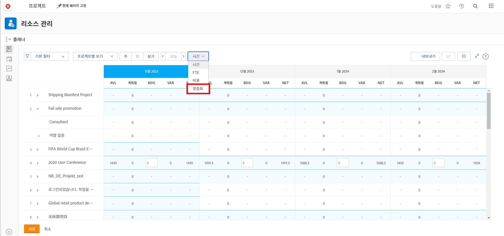
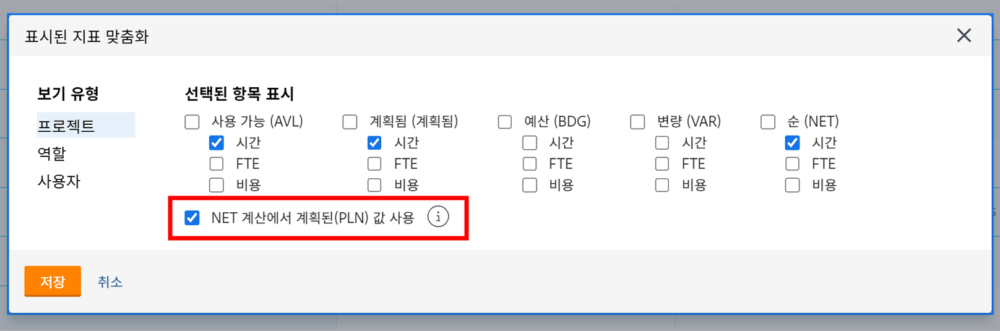
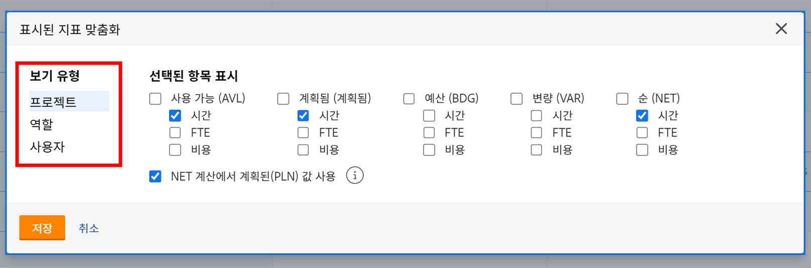
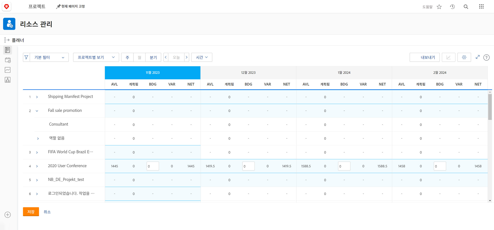

# [!DNL Resource Planner]의 프로젝트별 보기

이 비디오에서는 다음과 같은 작업을 수행합니다.

* [!UICONTROL 프로젝트별 보기] 참조
* 리소스 정보가 이 보기에 표시되는 방법 알아보기

>[!VIDEO](https://video.tv.adobe.com/v/3420158/?quality=12&learn=on&enablevpops=1&captions=kor)

프로젝트별 보기 옵션의 경우, 기본값은 비즈니스 사례에서 프로젝트에 필요한 예상 리소스 수를 가져오는 예산 열을 표시하는 것입니다(채워진 경우). 또한 기본적으로 Net 열이 예산 열의 숫자를 사용하여 남은 리소스 수를 알려 준다는 것을 의미합니다.

그러나 귀하의 조직은 해당 금액을 추정하기 위해 비즈니스 사례를 사용하지 않거나 사용할 준비가 되어 있지 않았을 수 있습니다. 대신 프로젝트에 이미 입력한 계획 시간을 사용합니다. 사용자 정의 옵션을 통해 선택한 보기에 표시되는 열과 Net 열 계산 방식을 선택할 수 있습니다.

계획된 시간을 기반으로 표시되는 열과 Net 열 계산을 변경하는 방법:

* 시간 드롭다운 메뉴를 클릭하고 사용자 정의를 선택합니다.

* 표시된 지표 사용자 정의 상자에서 표시할 열을 확인하고 NET 계산에서 계획된(PLN) 값 사용 옆의 상자를 선택합니다.

**메모**: 상자 왼쪽에 있는 옵션을 선택하여 리소스 플래너에서 다양한 보기 유형에 대한 열 및 계산을 편집할 수 있습니다.

* 저장을 클릭하면 상자가 닫히고 화면이 새로 고쳐집니다.

리소스 플래너는 복잡한 스프레드시트 및 라운드 로빈 커뮤니케이션 없이 공급과 수요에 대해 알아야 할 사항을 보여 줍니다.

수중에 있는 정보와 자유롭게 사용 가능한 도구로 팀의 역량을 미세 조정하여 중요한 작업을 실행할 수 있습니다.
