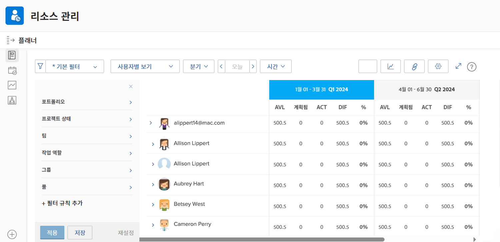

# 활용성 보기 및 리소스 플래너 필터링

리소스 플래너를 사용하면 관심 있는 프로젝트를 명확하게 볼 수 있으며, 작업 인력이 이러한 프로젝트를 실행하기 위해 어떻게 누적되는지 실시간으로 살펴볼 수 있습니다.

* 예를 들어 최신 서버 업데이트 이니셔티브가 최우선 순위가 되었을 때 용량이 어떻게 되는지 알고 싶을 수 있습니다.

* 리소스 플래너는 직원의 가용성과 한 프로젝트에 리소스를 할당하면 우선순위가 낮은 프로젝트의 가용성에 어떤 영향을 주는지 보여줍니다.

리소스 할당이 오늘날의 작업에 미치는 영향 뿐만 아니라 즉각적인 리소스 스케줄링 요구 사항을 벗어나는 경우 장기적인 리소스 할당을 평가하여 개인이 초과 또는 과소 할당되었는지 파악할 수 있습니다.

## 리소스 플래너 필터링

리소스 플래너가 기본 필터 세트와 함께 자동으로 열립니다. 이러한 필터를 편집할 기준:

* 시간대
* Portfolio/프로그램
* 리소스 풀 등

따라서 사용 가능한 리소스와 시기에 집중할 수 있습니다.
