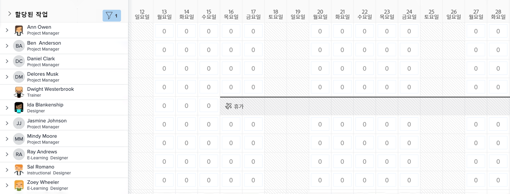
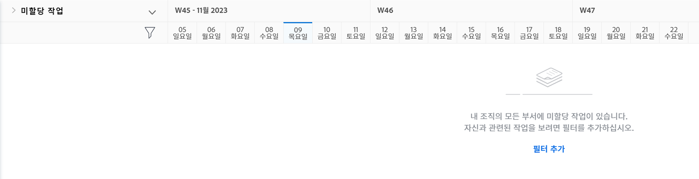

# [!DNL Workload Balancer] 찾기

사용 가능한 리소스와 배포 방법을 아는 것은 누구에게나 어려운 작업일 수 있습니다. 그래서 Workfront에는 [!DNL Workload Balancer]가 마련되어 있습니다.

목적은 사용자가 관리하는 인력의 일일 및 주간 워크로드에 대해 더 큰 인사이트와 관리 역량을 확보하는 것입니다. 이를 통해 여러 프로젝트에서 역할 및 가용성에 따라 더 효과적으로 작업을 할당할 수 있습니다.

* [!UICONTROL 메인 메뉴]에서 [!UICONTROL 리소스 조달]을 클릭합니다.
* ‘리소스 관리’ 영역의 [!UICONTROL 예약] 섹션으로 이동합니다.
* 표시되는 [!UICONTROL “Workload Balancer”] 섹션을 클릭합니다.

## Workload Balancer 내의 영역

[!DNL Workload Balancer]에 ‘할당된 작업’ 및 ‘할당되지 않은 작업’이라는 두 섹션이 표시됩니다.

‘할당된 작업’ 영역에는 사용자 목록과 Workfront 내에서 이미 할당된 작업이 표시됩니다. 기본적으로 이 영역은 귀하가 속한 Workfront 팀에 속한 사용자로 필터링됩니다. 이렇게 하면 어떤 팀원이 할당되었는지 확인할 수 있습니다.

‘할당되지 않은 작업’ 영역에는 사람, 작업 역할 또는 팀에 관계없이 여전히 할당해야 하는 작업이 표시됩니다. 다만 처음에는 이 영역에 아무것도 표시되지 않습니다.

‘할당되지 않은 작업’ 영역을 공백으로 시작하면 할당에 앞서 먼저 ‘할당된 작업’ 영역에서 사용자의 현재 워크로드에 집중할 수 있습니다.
