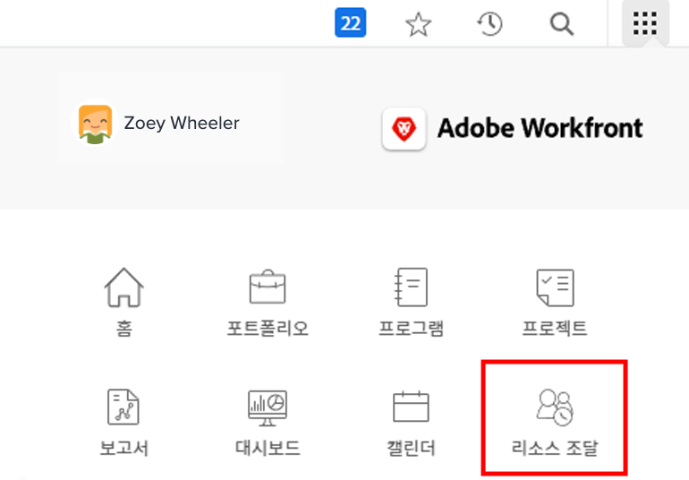
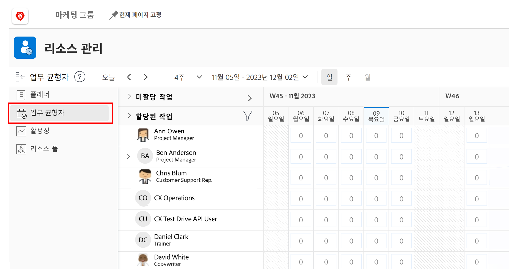
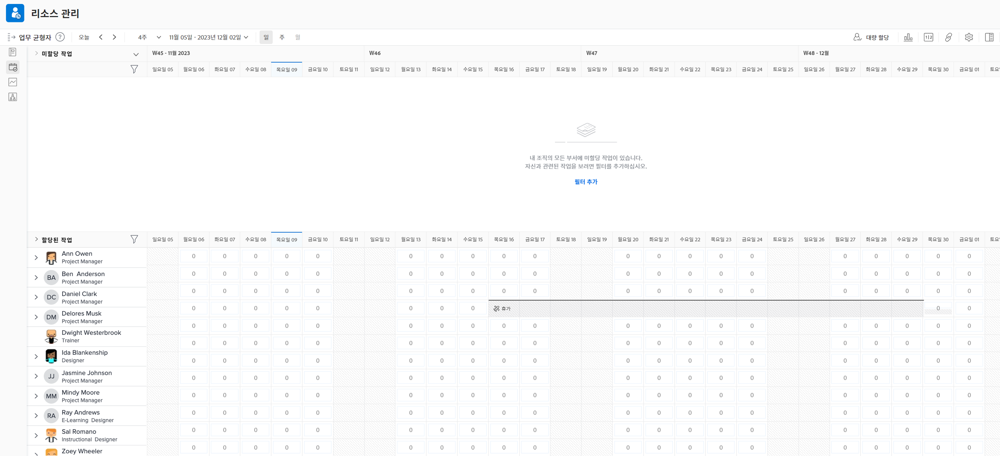

# 를 찾습니다. [!DNL Workload Balancer]

사용 가능한 리소스와 배포 방법을 아는 것은 누구에게나 힘든 일이 될 수 있습니다. Workfront이 [!DNL Workload Balancer].

이 소프트웨어의 목적은 사용자가 관리하는 사람의 일별 및 주별 워크로드를 보다 효과적으로 파악하고 관리할 수 있도록 하는 것입니다. 따라서 여러 프로젝트에서 역할 및 가용성을 기반으로 보다 나은 지정을 수행할 수 있습니다.

* 클릭 [!UICONTROL 리소스] 에서 [!UICONTROL 기본 메뉴].
* 로 이동합니다. [!UICONTROL 작업 로드 밸런서] 섹션을 참조하십시오.

## 작업 로드 밸런서 내의 영역

두 섹션은 [!DNL Workload Balancer]: 할당된 작업 및 미지정 작업.

할당된 작업 영역 에는 Workfront 내에서 이미 할당된 사용자 목록과 작업이 표시됩니다. 기본적으로 이 영역은 사용자가 속한 Workfront 팀의 일부인 사용자로 필터링됩니다. 이렇게 하면 작업에 배정된 팀원이 확인할 수 있습니다.

미지정 작업 영역에는 개인, Job 역할 또는 팀에 할당되어야 하는 작업이 표시됩니다. 그러나 처음에는 이 지역이 아무것도 표시되지 않습니다.

[지정되지 않은 작업 영역]을 공백으로 시작하면 먼저 할당하기 전에 [지정된 작업 영역]에서 사용자의 현재 작업 로드에 집중할 수 있습니다.
