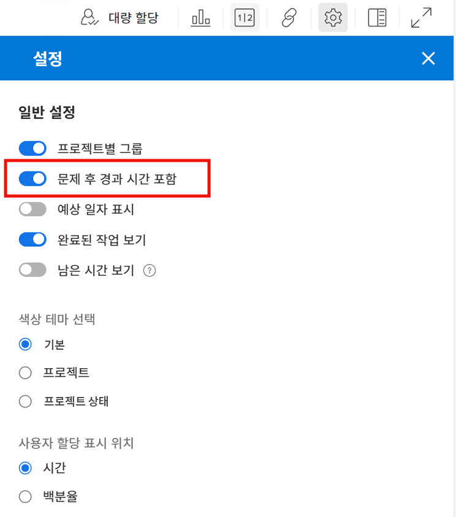
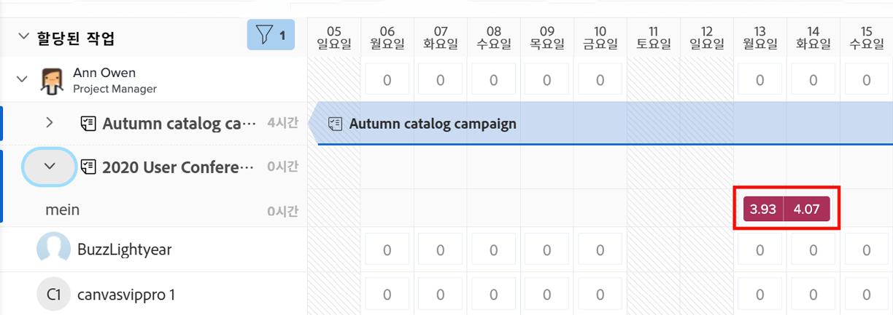
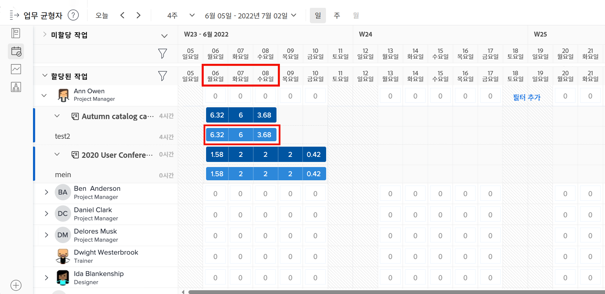
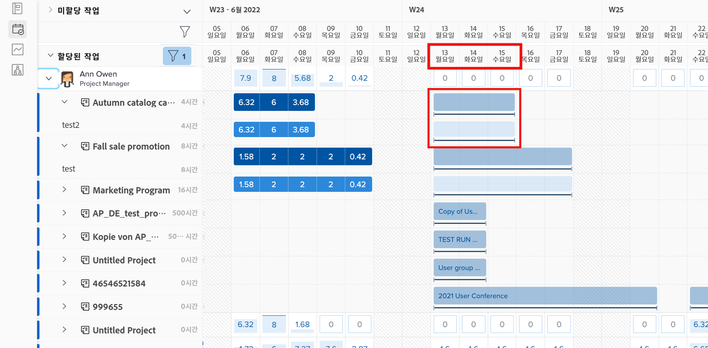
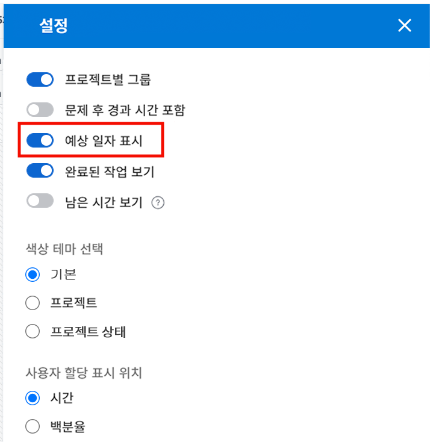
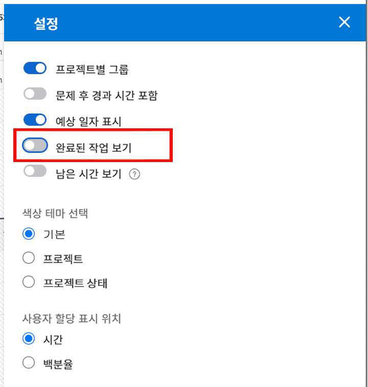

# 워크로드 밸런서에 대해 고려해야 할 설정

사용자의 개별 워크로드를 자세히 살펴볼 때 고려해야 할 몇 가지 워크로드 밸런서 설정이 있습니다.

* 문제 할당
* 예상 일자
* 완료된 작업

이는 워크로드 밸런서 설정 아이콘을 통해 켜거나 끌 수 있습니다.

## 문제의 시간 포함

기본적으로 워크로드 밸런서는 작업만 표시합니다. 그러나 사용자는 이행하거나 해결해야 하고 프로젝트 작업에 소요되는 시간을 낭비하는 요청 및 문제에 할당될 수 있습니다.

Workfront는 사용자의 전체 워크로드를 더 잘 이해하기 위해 할당된 사용자 작업 목록에 문제를 포함할 것을 권장합니다.

워크로드 밸런서 설정 영역에서 문제 후 경과 시간 포함 옵션을 선택하기만 하면 됩니다.

할당된 작업 영역에서 문제는 밝은 적갈색 막대로 나타납니다.

### 프로젝트 일자

워크로드 밸런서 설정을 통해 사용할 수 있는 또 다른 옵션은 예상 일자를 기준으로 워크로드를 표시하는 것입니다.

기본 설정은 프로젝트에 입력된 계획된 일자를 기준으로 할당된 작업을 표시합니다.

예상 일자는 프로젝트에서 이전 작업의 진행 상황 및 완료를 기반으로 하므로 작업이 시작 또는 완료되는 시점에 대한 “실시간” 보기를 얻을 수 있으며 이는 워크로드를 볼 때 특히 유용합니다.

워크로드 밸런서 설정의 예상 일자 표시 옵션을 사용하여 계획된 일자 보기와 예상 일자 보기 간에 전환할 수 있습니다.

### 완료된 작업

완료된 작업은 워크로드 밸런서에 현재 진행 중이거나 곧 시작할 작업과 함께 표시됩니다. 사용자가 수행할 수 있는 추가 작업을 더 잘 이해하도록 완료된 작업은 제외할 수 있습니다.

워크로드 밸런서 설정에서 완료된 작업 표시 옵션을 선택 취소합니다.

