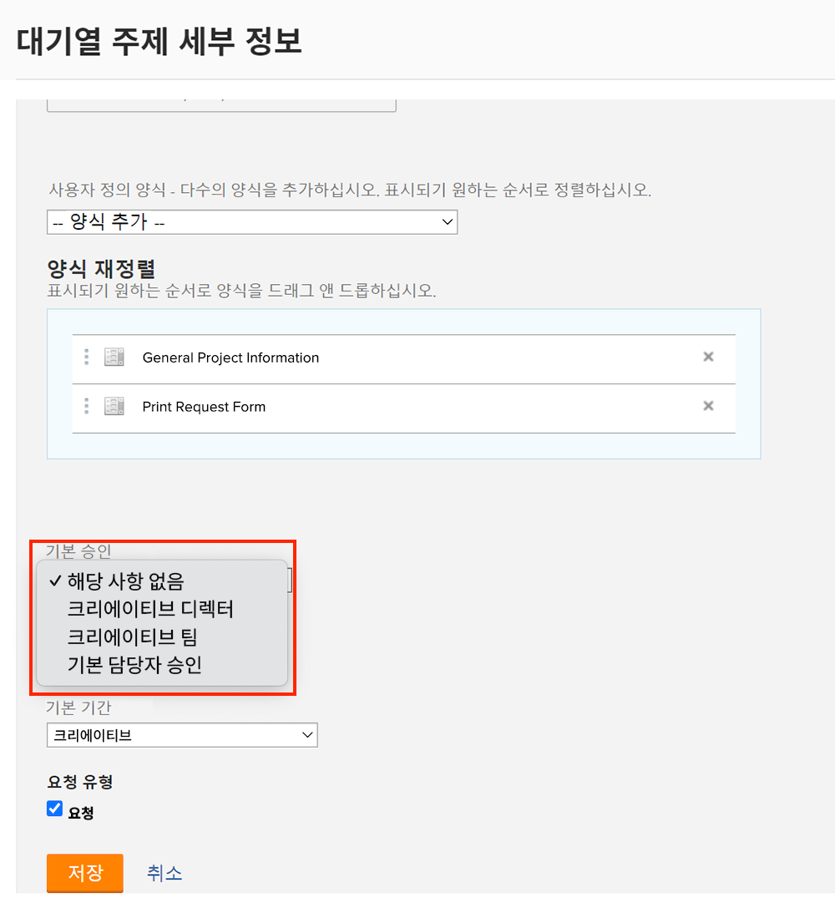
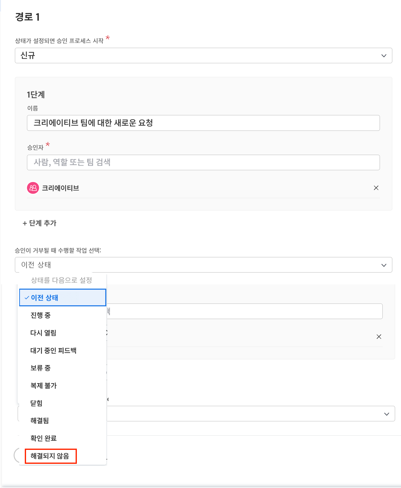

# 글로벌 및 일회용 승인 프로세스 만들기

프로젝트 관리자는 프로젝트, 작업 및 문제에 대한 승인 프로세스를 통해 작업이 제대로 완료되었는지 전문가의 확인을 받은 후 작업을 계속 진행할 수 있습니다. 프로젝트 관리자는 각 상황에 대한 승인 프로세스(단일 사용 승인 프로세스라고 함)를 생성하거나 일반적인 요구 사항을 충족하기 위해 이전에 생성된 가능한 많은 승인 프로세스(전역 또는 기존 승인 프로세스라고 함) 목록에서 선택할 수 있습니다.

두 경우 모두 오브젝트 상태가 승인 프로세스에서 지정된 상태로 변경되면 승인자에게 작업 검토 및 승인 또는 거부에 대한 다양한 방법이 통보됩니다. 승인을 기다리느라 전체 프로젝트가 일시 중지될 수 있으므로 승인자는 승인 요청이 있을 수 있음을 미리 인지하고 있어야 합니다. 승인자가 어떤 이유로든 부재 중인 경우 자격을 갖춘 대체자에게 승인을 위임할 수 있습니다. 자세한 내용은 [작업, 문제 및 승인 위임](/help/manage-work/approval-processes-and-milestone-paths/delegate-approvals.md)을 참조하십시오.

이 비디오에서는 프로젝트, 작업 또는 문제에 대한 전역 승인 프로세스와 일회용 승인 프로세스를 만드는 방법에 대해 알아봅니다.

>[!VIDEO](https://video.tv.adobe.com/v/335225/?quality=12&learn=on)

>[!TIP]
>
>프로젝트 또는 작업에 대한 일회용 승인 프로세스를 프로젝트 템플릿에 추가할 수 있습니다.

>[!NOTE]
>
>비디오에서 작업에 대해 설명된 것과 동일한 방식으로 프로젝트 및 문제에 대한 일회용 승인을 설정할 수 있습니다.

## 요청 대기열에 자동 문제 승인을 적용하는 방법

요청 대기열에서 자동 문제 승인을 설정하려는 경우 글로벌 문제 승인 프로세스를 사용해야만 이 작업을 수행할 수 있으며 [!UICONTROL 대기열 주제]에 적용됩니다.

[!UICONTROL 대기열 주제]를 만들거나 편집할 때 **[!UICONTROL 기본 승인]** 필드에서 전역 승인 프로세스를 선택합니다.

승인이 거부될 때 **[!UICONTROL 이전 상태]**&#x200B;가 문제가 설정된 상태가 아닌지 확인하려면 문제 승인 프로세스를 편집해야 할 수 있습니다. 이는 이전 상태가 **[!UICONTROL New]**&#x200B;이고 승인 프로세스를 트리거하는 상태이기도 하므로 승인될 때 이 상태로 설정되기 때문입니다. 문제 승인이 거부될 때 혼동을 방지하기 위해 상태를 **[!UICONTROL 해결되지 않음]** 또는 이 용도로 만든 사용자 지정 상태로 설정하는 것이 좋습니다.

## 이 주제와 관련된 추천 튜토리얼

* [작업, 문제 및 승인 위임](/help/manage-work/approval-processes-and-milestone-paths/delegate-approvals.md)
* [기존 승인 프로세스 첨부 및 편집](/help/manage-work/approval-processes-and-milestone-paths/attach-and-edit-existing-approval-processes.md)
* [그룹별 승인 프로세스 이해](/help/administration-and-setup/approval-processes-and-milestone-paths/group-specific-approval-processes.md)
* [요청 흐름 만들기](/help/manage-work/request-queues/create-a-request-flow.md)

