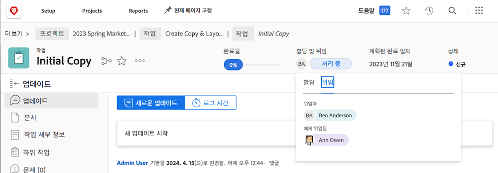

# 작업, 문제 및 승인 위임

프로젝트, 작업, 문제 및 타임카드에 대한 승인을 다른 Workfront 사용자에게 위임하는 방법을 알아봅니다. 작업 및 문제 지정을 위임하는 방법도 알아봅니다.

## 승인 위임

프로젝트, 작업, 문제 및 타임카드에 대한 승인을 다른 사용자에게 위임하는 방법을 알아봅니다.

이 비디오에서는 다음 방법을 배웁니다.

* 다른 사람에게 승인 할당
* 위임 기간 종료
* 위임된 승인 찾기

>[!VIDEO](https://video.tv.adobe.com/v/336094/?quality=12)

<!---
learn more URLS
Delegate approval request
--->

## 작업 및 문제 지정 위임

부재 예정인 경우 다른 사용자에게 할당된 작업 및 문제를 위임할 수 있습니다.

### 작업 및 문제 지정 위임을 활성화하는 방법

이 기능을 사용하려면 그룹 또는 시스템 관리자가 작업 및 문제 위임을 활성화해야 합니다. 이 작업은 [!UICONTROL 설정 > 프로젝트 환경 설정 > 작업 및 문제 > 위임]. 이 기능을 활성화하면 검토 이상의 라이센스가 있는 모든 사용자가 할당된 작업 및 문제를 위임할 수 있습니다.

![스크린샷에 표시 [!UICONTROL 설정] 위임 기본 설정](assets/delegation-1.png)

### 작업 및 문제 지정을 위임하는 방법

다음으로 이동 [!UICONTROL 홈] 을(를) 클릭합니다. [!UICONTROL 위임]을 선택한 다음 할당된 모든 작업을 위임하는 사용자와 날짜 범위를 지정합니다. 검토 이상의 라이센스가 있는 사용자를 모두 지정할 수 있습니다.

![의 위임 탭을 보여주는 스크린샷 [!UICONTROL 홈]](assets/delegation-2.png)

### 작업 또는 문제가 위임되었는지 확인하는 방법

에서 작업 또는 문제가 위임된 시기를 확인할 수 있습니다. [!UICONTROL 홈] 또는 작업 또는 문제 보기에서 다음을 수행합니다.

![위임된 작업 할당을 보여주는 스크린샷 [!UICONTROL 홈]](assets/delegation-4.png)

### 위임된 작업에 적용되는 이메일 알림

그룹 또는 시스템 관리자는 사용자가 작업 및 문제를 위임했을 때, 사용자의 작업 및 문제가 사용자에게 위임된 경우를 알리는 이메일 알림을 활성화할 수 있습니다.

![스크린샷에 표시 [!UICONTROL 설정] 위임에 대한 이메일 알림 옵션](assets/delegation-5.png)

