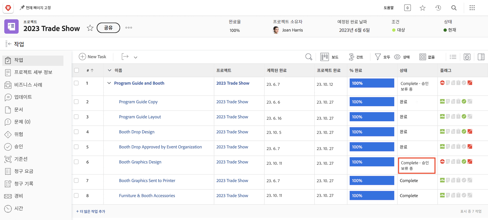
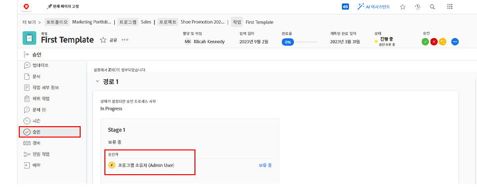

# 승인 완료

작업 및 문제 승인은 많은 워크플로의 일부입니다. 그러나 해결되지 않은 승인으로 인해 프로젝트 상태를 완료로 설정할 수 없습니다.

다음에서 [!UICONTROL 작업] 프로젝트의 섹션에서 [!UICONTROL 보기] 다음을 포함합니다. [!UICONTROL 상태] 열. &quot;&quot;을(를) 사용하는 작업에 대한 승인이 완료되지 않은 경우 해당 열을 빠르게 살펴봅니다.[!UICONTROL - 승인 보류 중]상태 이름 뒤에 붙습니다.

수행할 작업에 대한 몇 가지 선택 사항이 있습니다.

* **승인 완료 —** 이는 다른 사람에게 미결 승인을 상기시키는 것을 의미할 수 있다. 작업을 열고 승인 탭을 클릭하면 승인자로 할당된 사용자를 확인할 수 있습니다.
* **승인 제거 —** 승인이 필요하지 않으면 삭제하는 것이 더 쉬울 수 있습니다. 이 작업을 수행할 수 있는 능력은 다음에 따라 다릅니다. [!DNL Workfront] 사용 권한.
* **상태 변경 —** 승인이 필요하지 않은 경우 승인이 첨부되지 않은 상태를 선택할 수 있습니다. 상태가 완료와 같은지 확인합니다.

조직에서 문제를 사용하여 프로젝트 중 문제, 변경 주문 또는 기타 이벤트를 추적하는 경우 [!UICONTROL 문제] 섹션에 있는 마지막 항목이 될 필요가 없습니다.
