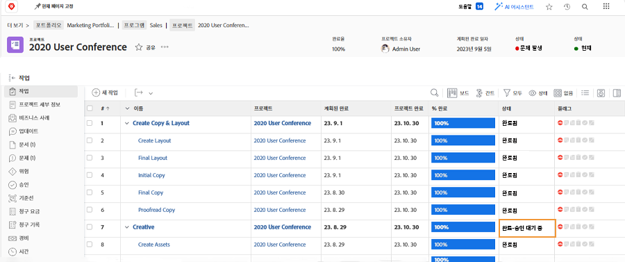

# 승인 완료

작업 및 문제 승인이 많은 워크플로우의 일부입니다. 그러나 해결되지 않은 승인은 프로젝트 상태를 완료로 설정하지 못하도록 할 수 있습니다.

설정 [!UICONTROL 작업] 프로젝트의 섹션에서 [!UICONTROL 보기] 여기에는 [!UICONTROL 상태] 열. 이 열을 간단히 보면 &quot;[!UICONTROL 승인 보류 중]&quot;를 입력합니다.

다음 중 몇 가지 방법을 선택할 수 있습니다.

* **승인 완료 —** 이는 다른 사람들에게 미결 승인을 상기시키는 것을 의미할 수 있습니다. 을 통해 업데이트로 수행합니다. [!DNL Workfront]. 사용자 [!DNL Workfront] 권한: 직접 승인을 완료할 수 있습니다.
* **승인 제거 —** 승인이 필요하지 않으면 삭제하기가 더 쉽습니다. 이 작업을 수행하는 기능은 [!DNL Workfront] 사용 권한.
* **상태 변경 —** 승인이 첨부되지 않은 상태를 선택합니다. 상태가 완료와 같은지 확인하십시오.

조직에서 문제를 사용하여 프로젝트 중에 문제, 주문 변경 또는 기타 이벤트를 추적하는 경우, [!UICONTROL 문제] 섹션에 액세스할 수 있습니다.
