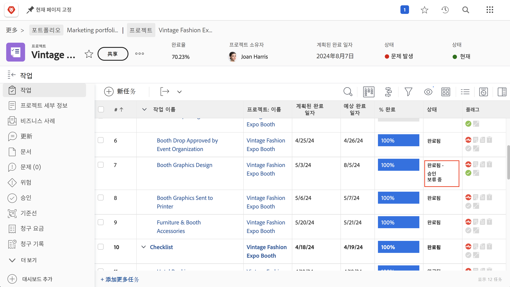
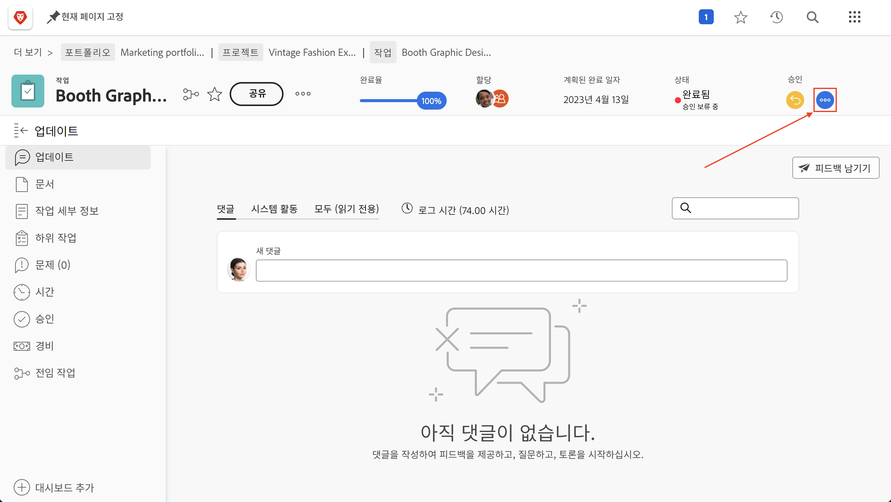
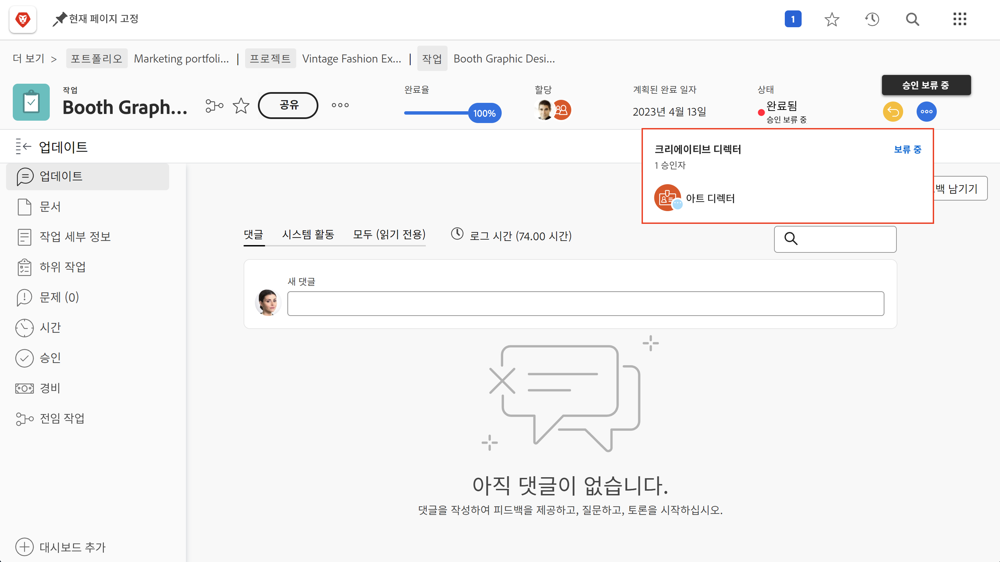
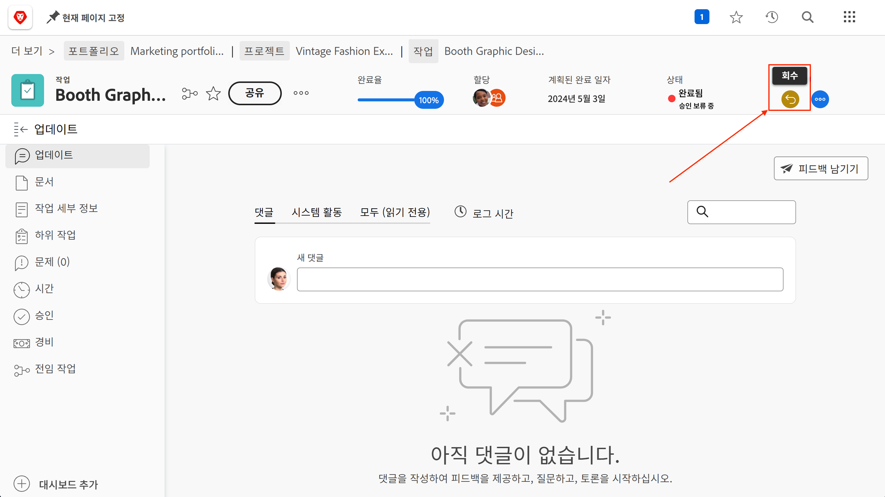
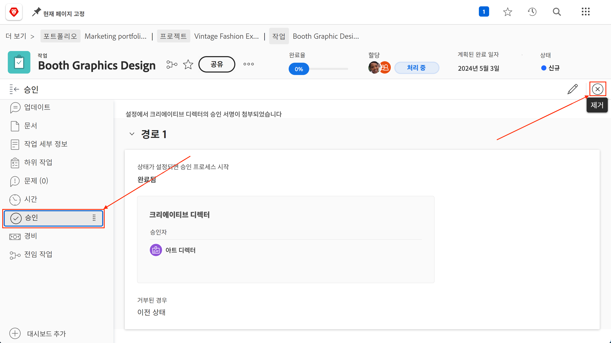

# 승인 완료

작업 및 문제 승인은 많은 프로젝트의 일부입니다. 그러나 미해결 승인이 있으면 프로젝트 상태를 “완료”로 설정할 수 없습니다.

이러한 문제를 찾아내고 해결하는 방법은 다음과 같습니다.

프로젝트의 [!UICONTROL 작업] 섹션에서 [!UICONTROL 상태] 열이 포함된 [!UICONTROL 보기] (예: [!UICONTROL 상태] 보기)를 선택합니다. 해당 열을 간단히 살펴보면 상태 이름 뒤에 “[!UICONTROL - 승인 보류 중]” 표시가 있는 작업에 대해 완료되지 않은 승인이 있는지 확인할 수 있습니다.

아직 승인을 기다리고 있는 작업을 찾았다면 다음 두 가지 중 하나를 선택할 수 있습니다.

## 승인 완료

이는 할당된 사용자에게 미처리된 승인 내용을 상기시키는 것을 의미할 수 있습니다. 작업을 열고 승인 영역의 점 세 개로 된 메뉴를 클릭하면 누가 승인자로 할당되었는지 확인할 수 있습니다.

할당된 승인자를 보여 주는 상자가 나타납니다.

## 승인 제거

승인이 필요하지 않다면 제거할 수도 있습니다. 먼저 승인을 회수하여 이를 수행할 수 있습니다. 승인 영역에서 [!UICONTROL 회수] 버튼을 클릭합니다. 이렇게 하면 상태가 이전 상태로 돌아가고 승인 프로세스를 제거할 수 있습니다.

이제 왼쪽에 있는 [!UICONTROL 승인] 탭을 클릭한 다음 오른쪽 위에 있는 [!UICONTROL 제거] 버튼을 클릭합니다.

## 문제 승인 처리

조직에서 프로젝트 도중 문제를 추적하거나 주문 또는 기타 이벤트를 변경하는 경우, 프로젝트의 [!UICONTROL 문제] 섹션에서 동일한 단계를 수행합니다.
