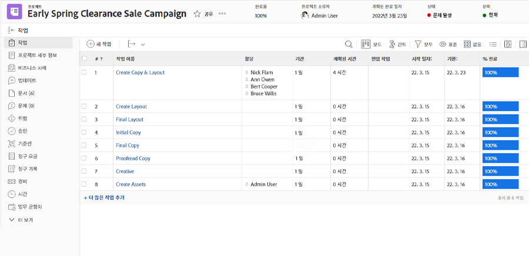

# 로그 및 검토 시간

실제 작업 시간 로깅이 조직의 워크플로우의 일부인 경우 [!UICONTROL 시간] 프로젝트의 섹션(왼쪽 패널 메뉴에서 선택)입니다. 개별 작업 및 프로젝트 자체에 대해 기록된 모든 시간을 표시합니다. 이 페이지에서 몇 시간을 기록할 수도 있습니다.

>[!NOTE]
>
>조직은 다음을 통해 시간을 승인하도록 요청할 수 있습니다. [!DNL Workfront] 작업표. 내부 확인 [!DNL Workfront] 팀을 구성하여 사용해야 하는 프로세스를 확인합니다.

<!---
learn more url
Log time
--->
