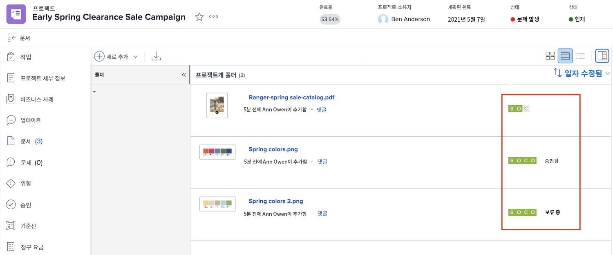
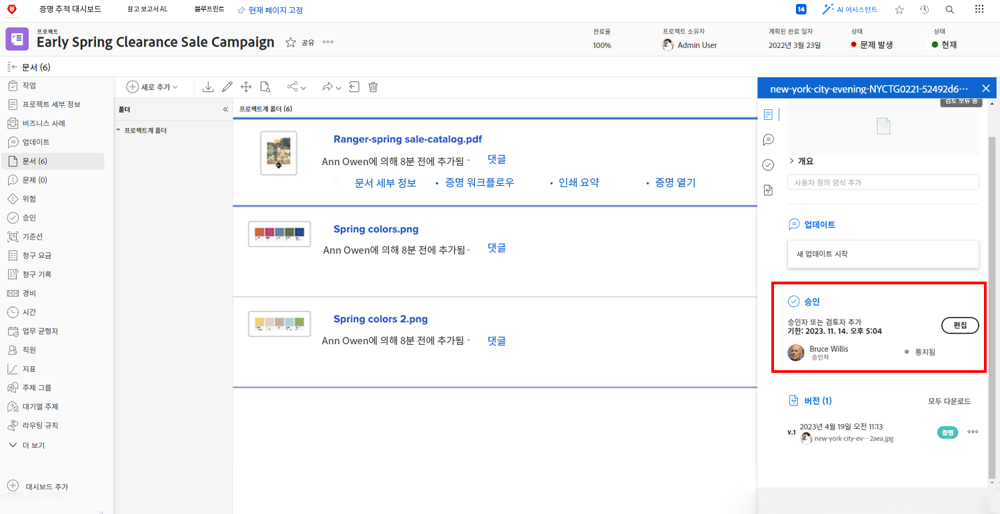

# 자산 업로드

[!DNL Workfront] 프로젝트를 종료하기 전에 모든 관련 파일이 [!UICONTROL 문서] 섹션에 첨부되어 있는지 확인합니다. 조직 지침에 따라 이를 문서 또는 증명으로 업로드합니다.

문서 또는 증명을 기존 파일 버전으로 업로드해야 할 수도 있습니다.

조직에서 증명 승인을 사용하는 경우, 진행률 아이콘을 한 눈에 확인하여 모든 승인이 완료되었는지 확인합니다.

조직에서 문서 승인을 사용하는 경우, 목록에서 각 항목을 선택하고 문서 세부 정보를 확인하여 승인이 완료되었는지 확인합니다.

<!---
learn more urls
Create proofs
Add new documents to Workfront
--->
