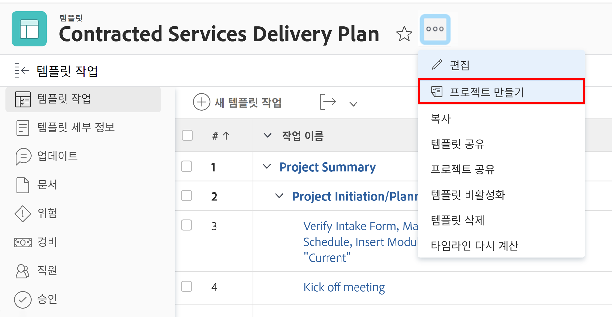
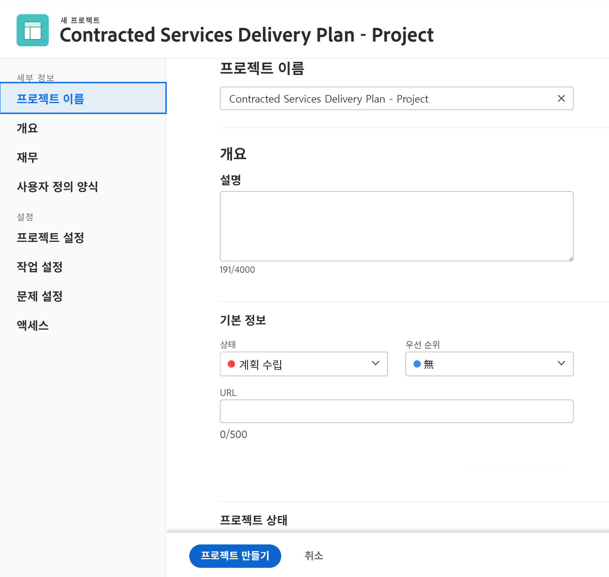
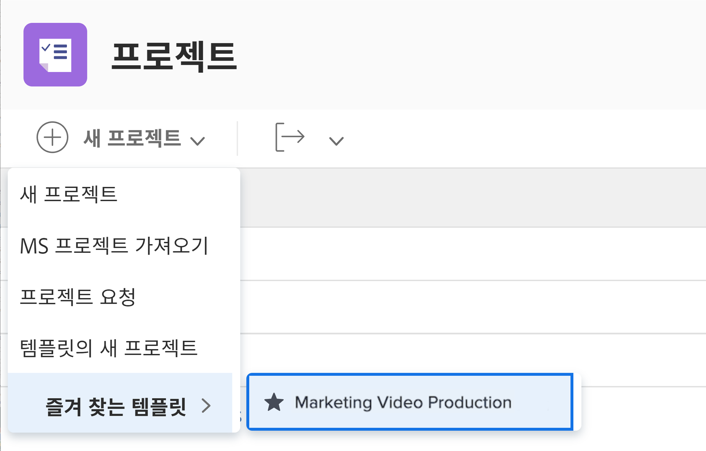

# 템플릿에서 직접 프로젝트 만들기

템플릿에서 작업 중인데 해당 템플릿을 사용하여 프로젝트를 만들어야 하는 경우, 템플릿 이름 옆에 있는 3개 점 메뉴를 클릭합니다. 그런 다음 프로젝트 만들기를 선택합니다.

세부 정보 창에서 새 프로젝트의 설정을 변경할 수 있습니다.

>[!NOTE]
>
>이 방법을 사용하여 프로젝트를 만들려면 Workfront의 템플릿 영역에 액세스해야 합니다. 템플릿에 액세스할 수 없는 경우에도 템플릿을 사용하여 프로젝트 영역에서 프로젝트를 만들거나 문제/작업을 변환할 수 있습니다.

**Pro-Tip**: 자주 사용하는 템플릿이 있으면 즐겨찾기로 만듭니다! 탐색 막대의 즐겨찾기 및 최근 요소 메뉴 아래에 표시되는 템플릿 외에 새 프로젝트 메뉴에 나열된 템플릿이 표시됩니다.

