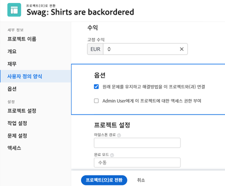
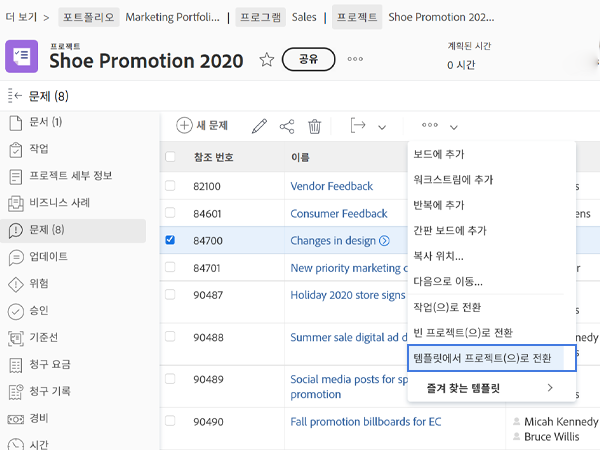

# 문제를 다른 작업 항목으로 변환

## 문제를 작업으로 변환

문제는 해결에 소요되는 시간과 노력을 프로젝트 타임라인에서 계상하고 적절한 리소스를 할당해야 할 만큼 충분할 수 있습니다. 이 경우 문제를 작업으로 변환할 수 있습니다.

![의 이미지 [!UICONTROL 작업으로 변환] 의 문제 옵션 [!UICONTROL Workfront].](assets/15-convert-issue-to-task-menu-option.png)

1. 로 이동합니다 [!UICONTROL 문제] 문제가 로그온된 프로젝트 또는 작업의 섹션. 또는 액세스 권한이 있는 보고서에서 문제를 찾습니다.
1. 문제 이름을 클릭하여 엽니다.
1. 문제 이름의 오른쪽에 있는 3점 메뉴에서 를 선택합니다 **[!UICONTROL 작업으로 변환]**.
1. 을(를) 입력합니다. [!UICONTROL 작업으로 변환] 양식. 먼저 새 작업에 이름과 설명을 지정합니다.
1. 새 작업이 다른 프로젝트의 일부여야 하는 경우 프로젝트 이름을 입력합니다.
1. 에서 [!UICONTROL 옵션] 섹션에서 확인란을 선택하여 원래 문제를 유지하고 새 작업에 대한 액세스를 허용하고 완료 날짜를 유지합니다. 이러한 선택을 할 때 조직의 워크플로우를 따릅니다. 문제의 사용자 지정 양식 데이터를 작업에 전송하려면 사용자 지정 양식을 첨부하십시오. 문제 양식과 작업 양식 모두에 있는 모든 필드는 자동으로 작업 양식으로 전송됩니다.
1. 첨부된 경우 사용자 지정 양식을 채웁니다.
1. 클릭 **[!UICONTROL 작업으로 변환]** 을 클릭하여 끝내십시오.

![의 이미지 [!UICONTROL 작업으로 변환] 의 문제 형태 [!UICONTROL Workfront].](assets/16-convert-to-task-options.png)

조직의 [!DNL Workfront] 시스템 설정은 작업을 변환할 때 옵션 섹션에서 설정을 변경할 수도 있고 변경할 수도 없습니다. 이 옵션은 원래 문제와 새 작업에 모두 영향을 줍니다.

* **&quot;원래 문제를 유지하고 이 작업에 해결 방법을 연결합니다.&quot;** 원래 문제 및 관련 정보(시간, 문서 등)를 유지합니다. 이 옵션을 선택하면 작업이 완료되면 문제가 해결된 것으로 표시됩니다. 이 옵션을 선택하지 않으면 작업 완료 시 원래 문제가 삭제됩니다. 이는 조직에서 문제를 추적하고 보고하는 방법에 영향을 줄 수 있습니다.
* 다음 **&quot;이 작업에 액세스할 수 있도록 허용(사용자 이름)&quot;** 옵션을 사용하면 문제를 만든 사람이 이 새 작업에 액세스할 수 있습니다.
* 다음 **&quot;문제의 계획된 완료 날짜를 유지합니다.&quot;** 옵션을 사용하면 문제에 대해 이미 설정된 계획 완료 날짜를 유지할 수 있습니다. 작업 제약 조건을 다음으로 설정합니다. [!UICONTROL 늦어도 다음 날짜 전까지 완료]. 상자를 선택 취소하면 작업 날짜가 프로젝트 내에 새 작업이 만들어지는 것처럼 설정됩니다.

새 작업은 프로젝트의 작업 목록 맨 아래에 배치됩니다. 작업을 원하는 위치로 이동하고, 사용자나 팀을 작업에 할당하고, 계획된 시간과 기간을 추가하는 등의 작업을 수행할 수 있습니다.

>[!NOTE]
>
>&quot;계획되지 않은 작업&quot;을 나타내므로 프로젝트 타임라인에 문제를 추가할 수 없습니다. 프로젝트 타임라인은 작업을 의미하는 &quot;계획된 작업&quot;을 위한 것입니다.

## 문제를 프로젝트로 변환

문제를 해결하는 프로세스를 보다 복잡하게 조정해야 하므로 문제 자체를 해결하거나 작업으로 변환하여 문제를 해결할 수 없는 경우가 있습니다. 이 경우 문제를 프로젝트로 변환할 수 있습니다.

1. 문제가 로그온된 프로젝트 또는 작업의 문제 섹션으로 이동합니다. 또는 액세스 권한이 있는 보고서에서 문제를 찾습니다.
1. 문제 이름을 클릭하여 엽니다.
1. 문제 이름의 오른쪽에 있는 3점 메뉴를 클릭하여 자세히 메뉴를 표시합니다.
1. 그런 다음 완전히 비어 있는 새 프로젝트를 만들거나 프로젝트 템플릿을 사용하여 작업 및 타임라인 정보를 미리 채우려면 선택합니다.
1. 프로젝트 이름으로 시작하는 프로젝트로 변환 창에 정보를 입력합니다.
1. 팀이나 조직에서 필요로 하는 다른 프로젝트 세부 사항을 입력합니다.
1. 옵션 섹션에서 상자를 선택하여 원래 문제를 유지하고 새 프로젝트에 대한 액세스를 허용합니다. 이러한 선택을 할 때 조직의 워크플로우를 따릅니다.
1. 첨부된 경우 사용자 지정 양식을 채웁니다. 문제의 사용자 지정 양식 데이터를 프로젝트로 전송하려면 사용자 지정 양식을 첨부합니다. 문제 양식과 프로젝트 양식 모두에 있는 모든 필드는 자동으로 프로젝트 양식으로 전송됩니다.
1. 클릭 **프로젝트로 변환** 을 클릭하여 끝내십시오.

프로젝트로 변환 창에 표시되는 프로젝트 세부 정보 필드는 프로젝트를 만드는 데 사용한 방법에 따라 다릅니다. 템플릿에서 프로젝트로 변환 옵션을 사용하면 왼쪽 메뉴에 자세한 정보가 표시됩니다.

>[!NOTE]
>
>옵션 섹션과 같은 일부 섹션은 표시되지만 조직의 Workfront 시스템 설정에 따라 액세스할 수 없을 수도 있습니다.

* 클릭 &quot;**원래 문제를 유지하고 이 프로젝트에 해결 방법을 연결합니다**&quot; 옵션을 선택합니다. 이 옵션은 원본 문제 및 관련 정보(시간, 문서 등)를 유지합니다. 새 프로젝트가 완료되면 문제가 해결된 것으로 표시됩니다. 이 옵션을 선택하지 않으면 프로젝트 완료 시 원래 문제가 삭제됩니다. 이는 조직에서 문제를 추적하고 보고하는 방법에 영향을 줄 수 있습니다.
* &quot;**이 프로젝트에 액세스할 수 있도록 허용(사용자 이름)**&quot; 옵션을 사용하면 문제를 만든 사람이 만들 프로젝트에 액세스할 수 있습니다.

## 변환 프로세스 중 정보 유지

<!-- Need link to wf one doc article below 

To learn about what information transfers when you convert an issue to a task or project, we recommend you read through the conversion considerations in the article, Convert issues. This lists what information is kept when converting issues and what isn’t. Workfront recommends you become familiar with these considerations so you don’t lose important information when converting issues to tasks or projects.

-->

사용자 지정 양식 데이터를 전송하려면 다음 중 하나가 필요합니다.

* 동일한 사용자 지정 양식의 여러 사본(문제에 대한 사본, 작업에 대한 사본, 프로젝트에 대한 사본)입니다. 이러한 사용자 지정 양식의 필드는 정확히 일치해야 하므로 정보가 한 사용자 지정 양식에서 다른 사용자 지정 양식으로 전송될 수 있습니다.

* 또는 문제, 작업 및/또는 프로젝트 객체가 선택된 단일 사용자 지정 양식입니다. 이 방법을 사용하면 단일 사용자 지정 양식으로 사용자 지정 필드를 만들고 유지 관리하기만 하면 됩니다. 이는 최근 향상된 기능이며 동일한 양식의 여러 사본을 만드는 것보다 훨씬 쉽지만, 두 방법 중 하나는 작동합니다.

<!-- Need link to wf one doc article below

Learn more in the article, Transfer custom form data to a larger work item.

-->

<!-- Pro tips graphic -->

프로젝트 템플릿에 사용자 지정 양식을 포함하는 경우 전환 프로세스에서 템플릿을 선택하면 자동으로 할당됩니다.

<!-- Learn more graphic and documentation article links 

* Convert issues
* Transfer custom form data to a larger work item
* Overview of resolving and resolvable objects
* Understanding resolving and resolvable objects
* Unlink issues from their resolvable objects

-->

## 문제를 문제 목록에서 작업 또는 프로젝트로 변환

작업의 효율성을 높이고 빠르게 변화하는 환경에서 문제를 보다 쉽게 변환할 수 있도록 프로젝트, 보고서 또는 대시보드의 문제 목록에서 문제를 작업 또는 프로젝트로 변환할 수 있습니다. 문제를 선택한 다음 나타나는 3점 메뉴를 클릭하면 됩니다.

