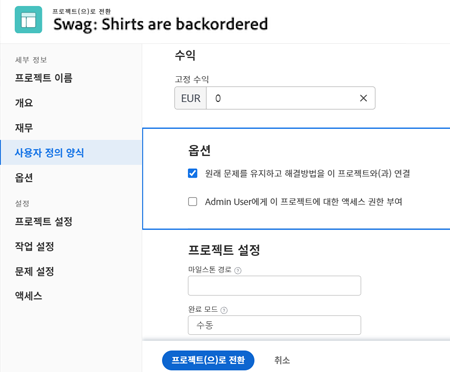

# 문제/요청을 프로젝트로 전환

이 비디오에서는 다음 방법을 배우게 됩니다.

* 요청과 함께 제출된 정보 검토
* 해당 프로젝트 템플릿 선택
* 요청에서 프로젝트로 전환 완료

>[!VIDEO](https://video.tv.adobe.com/v/340343/?quality=12&learn=on)

## [!UICONTROL 옵션] 섹션에 대해 알아야 할 사항

시스템 관리자가 설정한 기본값을 사용하기 위해 [!UICONTROL 옵션] 섹션을 숨길 수 있습니다. [!UICONTROL 옵션] 섹션이 나타나며, 여기서 옵션의 의미는 다음과 같습니다.

**원래 문제를 유지하고 해결 방법을 이 프로젝트에 연결**

이 옵션을 선택하면 프로젝트가 완료될 때 원래 문제가 해결된 것으로 표시됩니다. 이 옵션을 선택하지 **않으면** 프로젝트 생성 시 원래 문제가 삭제됩니다.

**(사용자 이름)이(가) 이 프로젝트에 액세스할 수 있도록 허용**

이 옵션을 선택하면 요청한 사람(또는 요청한 사람을 대신하여 요청한 사람)에게 생성된 새 프로젝트에 대한 액세스 권한이 자동으로 부여됩니다. 이 옵션을 선택하지 **않으면** 권한이 자동으로 부여되지 않습니다.

## 전환 프로세스 중 정보 유지

사용자 정의 양식 데이터를 전송하기 위해 다음 중 하나가 필요합니다.

* 동일한 사용자 정의 양식의 여러 사본(문제용으로 하나, 작업 또는 프로젝트용으로 하나) 이러한 사용자 정의 양식의 필드가 정확히 일치해야 정보가 하나의 사용자 정의 양식에서 다른 사용자 정의 양식으로 전송될 수 있습니다.

* 문제, 작업 및/또는 프로젝트 오브젝트가 모두 선택된 단일 사용자 정의 양식을 사용할 수 있습니다. 이 방법을 사용하면 단일 사용자 정의 양식에서 사용자 정의 필드를 만들고 유지하기만 하면 됩니다. 동일한 형식의 여러 사본을 만드는 것보다 훨씬 쉽지만, 두 가지 방법 모두 적합합니다.

프로젝트 템플릿에 사용자 정의 양식을 포함하면 전환 프로세스에서 템플릿을 선택할 때 자동으로 할당됩니다.

## 모든 문제 목록에서 문제를 작업 또는 프로젝트로 전환

작업의 효율성을 높이고 급변하는 환경에서 문제를 보다 쉽게 전환할 수 있도록 프로젝트, 보고서 또는 대시보드의 모든 문제 목록에서 문제를 작업 또는 프로젝트로 전환할 수 있습니다. 문제를 선택한 다음 표시되는 점 3개로 된 메뉴를 클릭하기만 하면 됩니다.

## 이 주제와 관련된 추천 튜토리얼

* [문제/요청을 작업으로 전환](/help/manage-work/issues-requests/convert-issues-to-other-work-items.md)
* [계획되지 않은 작업 처리](/help/manage-work/issues-requests/handle-unplanned-work.md)

