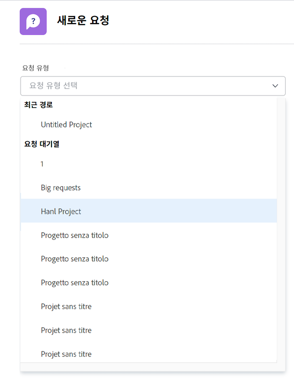
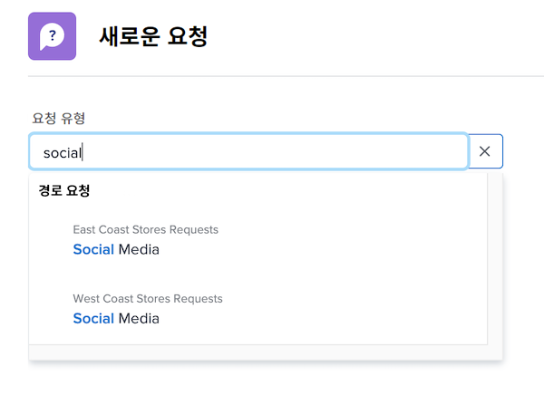
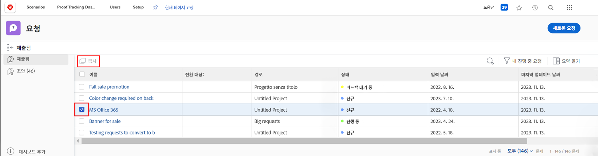
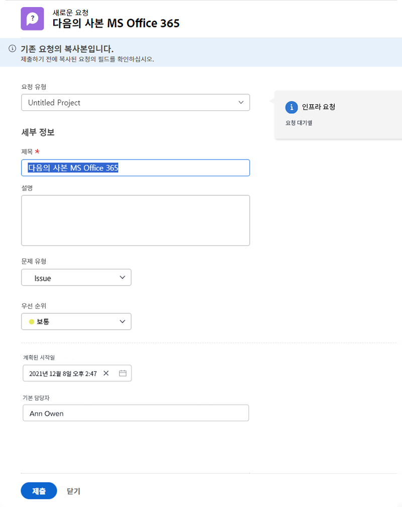

# 요청

많은 조직에서 새 프로젝트를 시작하거나, 새 제품을 개발하거나, 결과물을 만드는 첫 번째 단계는 [!DNL Workfront]. 요청에 대한 진행 상황을 추적하고 필요한 경우 추가 정보를 제공할 수 있습니다.

이 비디오에서는 다음 방법을 알아봅니다.

* 요청 영역으로 이동합니다.
* 요청
* 제출된 요청 보기
* 요청의 초안 찾기

>[!VIDEO](https://video.tv.adobe.com/v/336092/?quality=12)

## 빠르고 쉽게 요청 대기열 경로 액세스

다음을 클릭하면 [!UICONTROL 요청 유형] 필드입니다. 최근에 제출하여 목록 맨 위에 자동으로 표시되는 마지막 3개의 요청 경로입니다. 동일한 큐에 다른 요청을 제출하는 옵션을 선택합니다.

목록의 맨 아래에는 액세스 권한이 있는 모든 요청 대기열이 있습니다. 요청에 사용할 큐를 확실하지 않은 경우 키워드 검색을 사용하여 필요한 큐를 빠르고 쉽게 찾을 수 있습니다.

키워드를 입력할 때 [!DNL Workfront] 는 일치 항목을 표시하여 사용자의 요구 사항에 맞는 요청 대기열 경로를 찾을 수 있습니다. 예를 들어 소셜 미디어 게시물에 대한 요청을 하려면에 &quot;소셜 미디어&quot;를 입력하십시오. [!UICONTROL 요청 유형] 필드와 목록은 모든 일치 항목을 표시하도록 동적으로 업데이트됩니다.

원하는 옵션을 선택하고 요청 양식을 작성한 다음 요청을 제출합니다.

## 제출된 요청을 복사하여 새 요청 만들기

동일한 유형의 요청을 자주 제출하는 경우 각 요청을 새로 만들고 동일한 정보를 반복해서 작성하는 데 시간이 오래 걸립니다. 기존 요청을 복사하고 업데이트해야 하는 정보만 변경한 다음 새 요청으로 제출하여 프로세스 속도를 높입니다.

1. 메인 메뉴에서 요청 을 클릭합니다.
1. 왼쪽 패널 메뉴를 선택하여 제출됨 섹션에 있는지 확인합니다.
1. 복사할 요청을 찾아 선택합니다. 한 번에 하나의 요청만 복사할 수 있습니다.
1. 요청 목록 왼쪽 상단의 복사 및 새 이름으로 제출 아이콘을 클릭합니다.
1. 새 요청의 이름을 지정할 수 있도록 제목 필드가 강조 표시된 새 요청 창이 열립니다.
1. 필요에 따라 요청의 다른 정보를 업데이트합니다.
1. 제출을 눌러 완료합니다.
1. 복사된 요청이 새 요청으로 제출되고 제출됨 목록에 표시됩니다.

이전에 제출한 요청은 복사할 수 있지만, 요청 초안은 복사할 수 없습니다. 요청에 대한 보기 액세스 권한이 있는 한 다른 사용자가 제출한 요청을 복사할 수 있습니다.

<!---
Learn more
Requests area overview
Create and submit Workfront requests
Guides
Make a work request
--->
