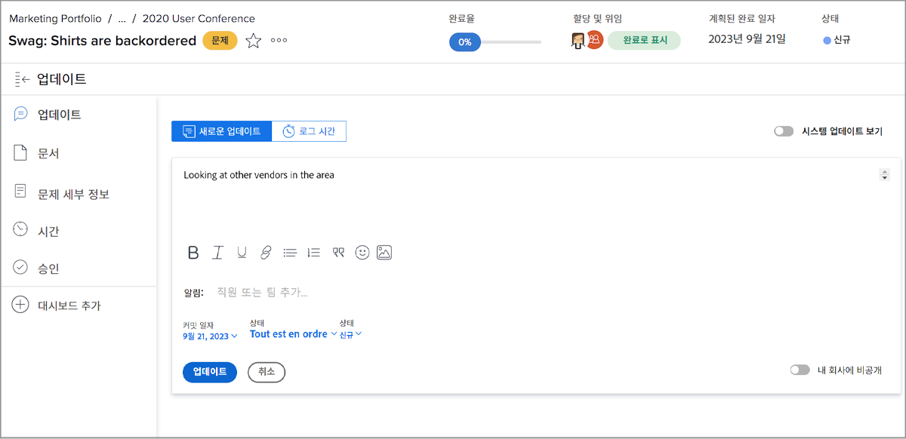
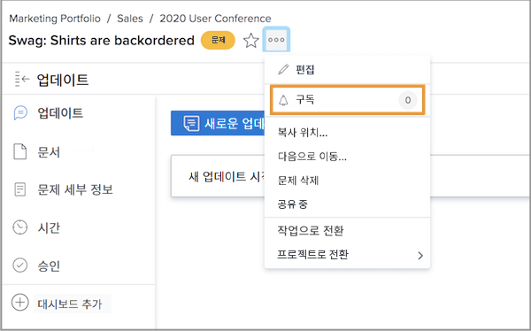
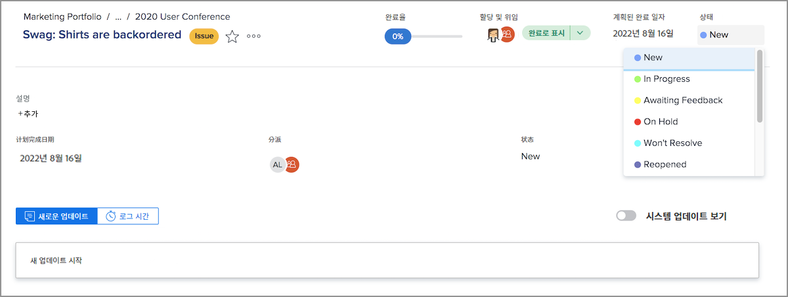
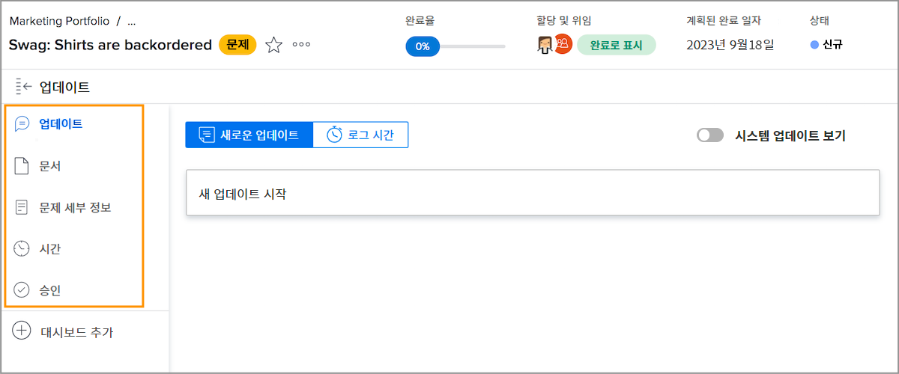

# 문제 지정 관리

## 문제 할당

로그인하는 중 [!DNL Workfront] 그것은 발생하는 문제들을 해결하는 첫 번째 단계입니다. 다음 단계에서는 연결된 작업을 완료하고 문제를 해결할 수 있도록 개별 사용자, 여러 사용자 또는 팀에 문제를 할당합니다.

문제를 할당하는 것은 작업을 할당하는 것과 같습니다. [!UICONTROL 지정] 필드. 그러면 해당 문제가 할당자의 [!UICONTROL 작업 목록] in [!DNL Workfront] [!UICONTROL 홈]. 팀에 할당되면 [!UICONTROL 팀 요청] 섹션 [!UICONTROL 팀] 페이지.

로그온한 모든 문제 및 프로젝트 자체는 [!UICONTROL 문제] 섹션에 있는 마지막 항목이 될 필요가 없습니다. 이를 통해 프로젝트 관리자, 계획자 및 기타 사용자는 프로젝트와 관련된 문제를 신속하게 지정할 수 있습니다.

에서 문제를 할당하는 방법에는 몇 가지가 있습니다 [!DNL Workfront].

* 로 이동합니다. [!UICONTROL 문제] 섹션 을 참조하십시오. 을(를) 클릭하여 [!UICONTROL 지정] 인라인 편집을 활성화할 필드에 작업을 완료해야 하는 사용자, 사용자 또는 팀의 이름을 입력합니다.
또한, [!DNL Workfront] 보고서 세트에 대해 설명합니다.

* 보고서 또는 **[!UICONTROL 문제]** 프로젝트 또는 작업의 섹션. 을(를) 클릭한 다음 **[!UICONTROL 지정]** 창의 오른쪽 위에 있는 헤더의 섹션에 있습니다. 클릭 시 **[!UICONTROL 저장]** 사용자 또는 팀 이름을 입력한 후 단추를 클릭합니다.

![를 클릭할 때 인라인 편집 옵션의 이미지입니다 [!UICONTROL 지정] 문제의 필드](assets/04-issue-assign-issue-list-assignments-field.png)

<!--
Learn more graphic and documentation article links
Assign issues
Edit user assignments for multiple issues
-->

## 문제 지정 수신

에서 사용자에게 할당된 문제를 확인할 수 있습니다. [!UICONTROL 작업 목록] in [!UICONTROL 홈].

![에서 문제 할당 이미지 [!UICONTROL 작업 목록] in [!UICONTROL 홈]](assets/05-workfront-home-work-list.png)

를 사용하십시오 [!UICONTROL 필터] 메뉴 아래의 제품에서 문제 만 확인할 수 있습니다.

![의 이미지 [!UICONTROL 필터] 메뉴의 [!UICONTROL 작업 목록] in [!UICONTROL 홈]](assets/06-workfront-home-issue-filter.png)

문제가 팀에 할당되면 [!UICONTROL 팀 요청] 섹션 [!UICONTROL 팀] 페이지. 팀 구성원은 [!UICONTROL 작업] 버튼을 클릭하여 지정을 수락하거나 팀 리드가 [!UICONTROL 재지정] 아이콘을 사용하여 특정 사용자에게 요청을 전달할 수 있습니다.

![의 이미지 [!UICONTROL 팀 요청] 섹션 [!UICONTROL 팀] 페이지](assets/07-team-page-work-on-it.png)

팀에 지정된 문제점도 [!UICONTROL 예약] 섹션을 참조하십시오. 이를 통해 팀 리더 및 다른 사용자가 작업을 할당하기 전에 어떤 팀 구성원이 작업 중인지 확인할 수 있습니다. 문제 표시줄을 [!UICONTROL 지정되지 않음] 영역을 팀 구성원의 달력에 지정하여 할당합니다.

![에서 팀 지정 이미지 [!UICONTROL 예약] 섹션을 참조하십시오.](assets/08-issue-assignment-team-schedule.png)

조직의 제공 방식에 따라 [!DNL Workfront] 을 설정하면 대시보드에 속한 보고서에서 사용자 또는 팀에 할당된 문제가 표시될 수도 있습니다.

<!-- Learn more graphic and documentation article links

* Display items in the [!UICONTROL Work List] in the [!UICONTROL Home] area
* Manage work and team requests in the [!UICONTROL Home] area

-->

## 문제에 대한 진행 상태 업데이트

사용자와 팀 구성원은 업데이트 및 문제에 대한 로그 시간을 게시하여 진행 중인 작업을 한눈에 파악할 수 있고 관련된 모든 사람이 작업 진행 상황을 업데이트할 수 있습니다.

에 업데이트를 게시하는 방법은 여러 가지가 있으므로 [!DNL Workfront]를 설정하는 경우 시스템 구성 및 워크플로우와 함께 작동하는 권장 방법에 대해 팀의 특정 지침을 따릅니다.

업데이트 및 시간은 [!UICONTROL 홈]. 클릭 **[!UICONTROL 새 업데이트]** 댓글을 달다.

![에서 문제에 대한 업데이트를 게시하는 이미지 [!UICONTROL 홈].](assets/09-workfront-home-update.png)

문제에 대해 언급할 때 소셜 미디어에서 사용할 수 있는 것처럼 @name 기능을 사용하여 다른 사용자나 팀에 메시지를 보낼 수 있습니다.

을(를) 클릭합니다. **[!UICONTROL 로그 시간]** 단추를 클릭하여 문제 해결 시간을 기록합니다.

![문제에 대한 시간 로깅 이미지 [!UICONTROL 홈].](assets/10-workfront-home-log-hours.png)

또는 문제를 열고(이름을 클릭) 정보를 여기에서 기록할 수 있습니다.

## 문제 구독

문제를 볼 수 있는 사람은 누구나 [!UICONTROL 구독] 로 전송하면 문제에 대한 업데이트/설명이 있을 때마다 알림을 보냅니다. 시간이 기록되거나, 상태가 변경되거나, 기타 편집이 수행된 경우에는 알림이 표시되지 않습니다.

구독은 다른 팀 구성원 또는 프로젝트 관리자가 관심이 있지만 할당하거나 적극적으로 작업하지 않는 작업을 추적하는 좋은 방법입니다.

<!-- Learn more graphic and link to documentation article

* Update or edit a work item in the Home area

-->

## 문제 상태 업데이트

댓글 또는 로깅 시간 외에도 문제 상태를 변경하여 작업 중임을 알리는 것을 잊지 마십시오. 그런 다음 작업이 완료되었음을 나타내도록 다시 변경합니다.

헤더의 상태를 [!UICONTROL 홈] 또는 문제 페이지를 연 경우

### 해결되지 않은 문제

상태가 완료 또는 그에 상응하는 것으로 업데이트되지 않은 경우 문제가 &quot;해결되지 않음&quot;으로 간주됩니다.

해결되지 않은 문제로 인해 연결된 작업이 완료된 것으로 표시되지 않고 프로젝트 상태가 완료로 설정되지 않습니다.

<!-- Learn more graphic and documentation article link

* Mark a work item as done in the Home area

-->

## 문제에 대한 추가 기능

문제 페이지에서는 팀 구성원 및 프로젝트 관리자가 문제를 올바로 기록하고 관리하는 데 필요한 추가 정보 및 기능에 액세스할 수 있습니다.

추가 [!UICONTROL 업데이트] 및 [!UICONTROL 시간]를 제외한 다른 정보는 문제를 연 후 왼쪽 패널 메뉴에서 액세스할 수 있습니다.

* **[!UICONTROL 문서]**- 문제와 관련된 문서를 업로드하고 검토합니다.
* **[!UICONTROL 문제 세부 정보]**- 설명, 우선순위, 심각도 및 계획된 완료 날짜와 같은 문제 정보를 변경합니다.
* **[!UICONTROL 승인]**- 문제에 대해 단일 사용 승인 프로세스를 설정하거나 글로벌 승인 프로세스를 적용합니다. 이 섹션에서 승인 진행 상황을 추적할 수도 있습니다.

문제 이름의 오른쪽에 있는 3점 메뉴 아래에서 문제를 복사, 삭제 또는 공유하는 옵션을 찾습니다.

<!-- Learn more graphic and documentation article links

* Edit issues
* Copy issues
* Share an issue
* Move issues
* Grant access to an issue

-->
