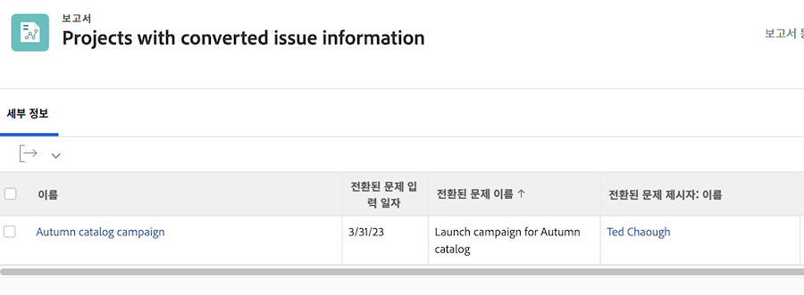

# 문제에 대한 보고서

보고서를 만들어 문제를 중앙 집중화하는 방법에 대해 알아봅니다.

## 보고서를 만들어 문제 중앙 집중화

많은 트래픽 및 프로젝트 관리자가 [!UICONTROL Workfront] 들어오는 모든 문제를 중앙에서 관리하는 사용자 지정 보고서입니다. 이렇게 하면 새로운 기능과 주의가 필요한 기능을 쉽게 추적할 수 있습니다.

그런 다음 보고서를 대시보드에 추가하여 작업을 수행하는 데 필요한 모든 것을 하나로 만들 수 있습니다 [!UICONTROL Workfront] 창.

![의 이미지 [!UICONTROL 해결 중 오브젝트] 문제 보고서 열입니다.](assets/18-resolving-object-report.png)

문제가 전환된 작업 또는 프로젝트의 이름을 표시하려면 &quot;[!UICONTROL 해결 중 오브젝트]보기에 있는&quot; 열입니다. A &quot;[!UICONTROL 해결 중 오브젝트]&quot;은 문제를 전환할 때 생성되는 작업 또는 프로젝트입니다. 문제가 전환되지 않은 경우 [!UICONTROL 해결 중 오브젝트] 필드가 비어 있습니다. 이 보고서를 사용하면 이미 전환된 문제를 빠르게 확인할 수 있으므로 중복이 발생하지 않습니다. 진행 중인 작업의 진행 상황을 추적할 수 있도록 해결 중 개체 이름을 클릭하여 열면 됩니다.

## 보고서에 원래 문제 정보 표시

문제가 프로젝트 또는 작업으로 전환되면 프로젝트 또는 작업 보고서에서 원래 문제 세부 정보의 대부분을 보고할 수 있습니다. 원래 문제는으로 참조됩니다.[!UICONTROL 전환된 문제]&quot;.

프로젝트 또는 작업 보고서에는 [!UICONTROL 전환된 문제 작성자] 개체 및 두 개의 전용 필드. 이러한 열은 텍스트 모드 없이도 사용자 정의 보기에 추가할 수 있습니다.

* [!UICONTROL 전환된 문제 입력 일자]
* [!UICONTROL 전환된 문제 이름]
* [!UICONTROL 전환된 문제 작성자 > 이름]

>[!NOTE]
>
>보기를 만드는 방법에 대한 지침은 [기본 보기 만들기](https://experienceleague.adobe.com/docs/workfront-learn/tutorials-workfront/reporting/basic-reporting/create-a-basic-view.html?lang=en).

