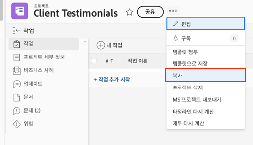

# 기존 프로젝트 복사

때로는 템플릿을 사용하여 프로젝트를 만드는 대신 다른 일회성 사용을 위해 프로젝트를 복사하기만 하면 됩니다. 이렇게 하려면 프로젝트에 대한 ‘편집’ 및 ‘만들기’ 액세스 권한이 있는 표준 라이선스가 있어야 합니다.

복사하려는 프로젝트로 이동하고 프로젝트 이름 옆에 있는 점 3개 메뉴를 클릭합니다. 그런 다음 ‘복사’를 선택합니다.

‘프로젝트 복사’ 창에서 제목과 상태를 변경할 수 있을 뿐만 아니라 할당, 문서 및 사용자 정의 데이터와 같이 프로젝트와 관련된 다양한 데이터 옵션을 지울 수 있습니다.

‘할당 지우기’를 선택하거나 상태를 ‘계획’으로 설정하면 프로젝트를 복사하더라도 복사 직후 작업 할당 알림을 보내지 않습니다.

## 이 주제와 관련된 추천 튜토리얼

* [템플릿에서 직접 프로젝트 만들기](/help/manage-work/create-and-manage-project-templates/create-a-project-directly-from-a-template.md)
* [작업](/help/manage-work/tasks/work-with-tasks.md)
* [프로젝트 계획에서 작업 할당](/help/manage-work/tasks/assign-tasks-from-the-project-plan.md)
