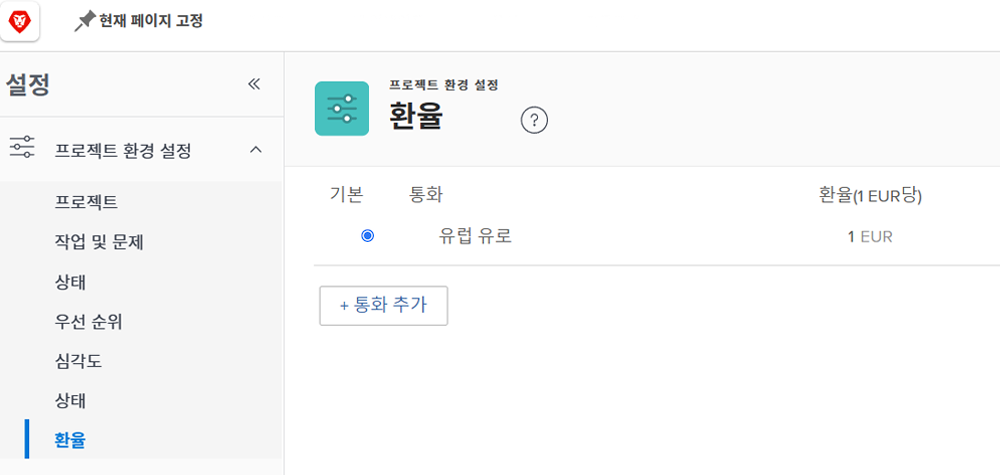
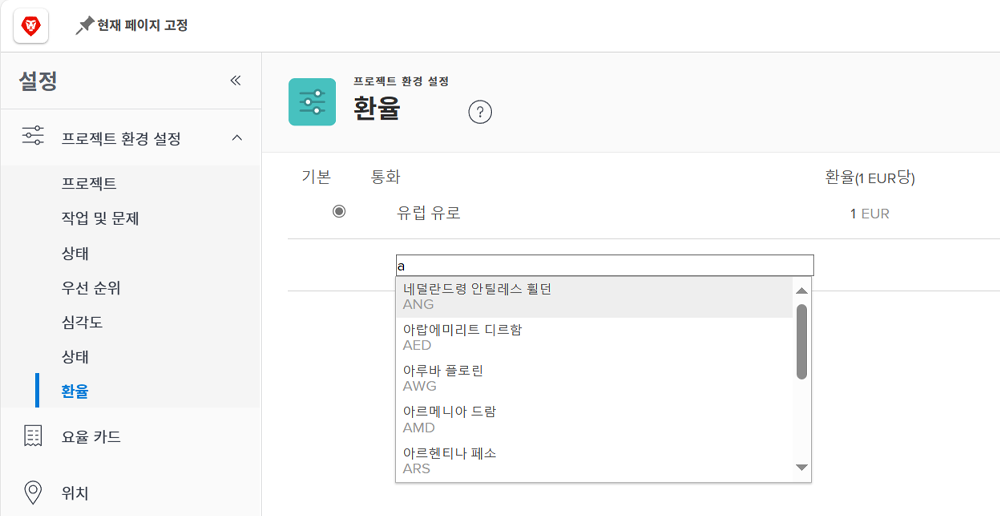

# 환율 설정

[!DNL Workfront] 는 다국적 기업인 고객 조직을 위해 다양한 통화를 지원합니다. 환율은 프로젝트 및 보고서에 전 세계의 다른 통화로 재무 정보를 반영하는 데 사용할 수 있습니다.

환율은 시스템 관리자가 관리합니다. 필요에 따라 조직에 대해 추가 통화를 설정할 수 있습니다.

Workfront의 기본 통화는 미국 달러입니다. 기본적으로 재무 정보가 계산되는 통화입니다. 이 기본값은 전역적으로 개별 프로젝트에서 변경할 수 있습니다.

## 통화 및 환율 설정

**선택 [!UICONTROL 설정] 기본 메뉴에서.**

1. 확장 **[!UICONTROL 프로젝트 환경 설정]** 왼쪽 메뉴 패널에서 을 참조하십시오.
1. 클릭 **[!UICONTROL 환율]**.
1. 다음을 클릭합니다. **[!UICONTROL 통화 추가]** 단추를 클릭합니다.
1. 드롭다운에서 국가 통화를 선택합니다.
1. 통화에 대해 원하는 환율을 입력합니다.
1. 미국 달러 이외의 통화는 [!DNL Workfront] 시스템의 기본(기본값) 통화를 사용하는 경우 통화 이름 옆에 있는 단추를 클릭합니다.
1. 클릭 **[!UICONTROL 저장]** 모든 통화가 추가된 경우.

>[!NOTE]
>
>Workfront은 환율에 대한 현재 시장 값을 업데이트하거나 추적하지 않습니다. 필요한 경우 수동으로 업데이트를 수행해야 합니다.
