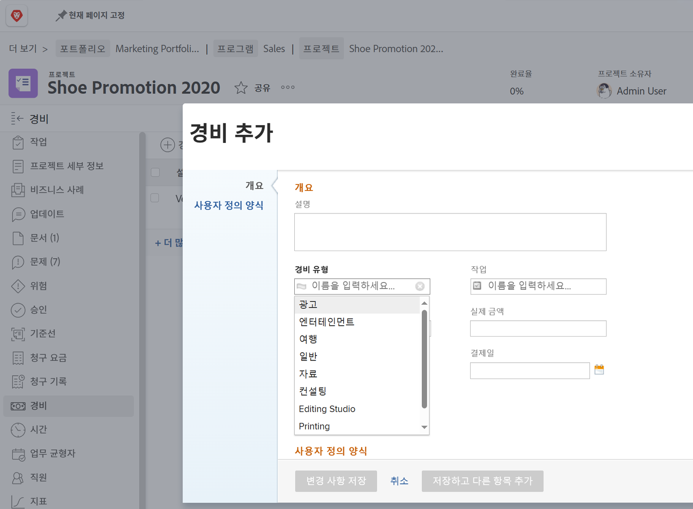

# 경비 유형 설정

의 경비 [!DNL Workfront] 프로젝트 및 기타 작업과 관련된 비인건비를 나타냅니다. 예를 들어 고객을 방문하는 동안 지출하거나 사진 촬영을 완료하는 데 필요한 물품을 구입하는 데 드는 비용이 있을 수 있습니다. 이러한 경비는 프로젝트 내에 기록되어야 하므로 모든 프로젝트에 대해 계획된 비용 및 실제 비용을 계산하고 보고할 수 있습니다.

[!DNL Workfront] 에는 경비를 입력할 때 사용할 수 있는 미리 작성된 경비 유형이 있습니다. 기본값을 삭제하거나 수정할 수 없지만 새 기본값을 추가할 수 있습니다.

* 광고
* 컨설팅
* 엔터테인먼트
* 일반
* 자료
* 인쇄 중
* 배송
* 여행

시스템 관리자는 조직에 필요한 경비 유형을 추가할 수 있습니다. 조직에서 필요한 재무 보고를 지원하기 위해 이러한 추가 경비 유형을 수정, 숨김 또는 삭제할 수 있습니다.

프로젝트 관리자, 경영진 등은 내부 작업, 프로젝트, 프로그램 또는 포트폴리오에 대해 개별 경비를 유형별로 그룹화하여 경비 보고서를 생성할 수 있습니다 [!DNL Workfront]. Project Financials는 경비 유형을 사용하여 훨씬 더 쉽게 관리할 수 있습니다.

## 경비 유형 만들기

**선택 [!UICONTROL 설정] 메인 메뉴에서**

1. 클릭 **[!UICONTROL 경비 유형]** 왼쪽 패널 메뉴에서 을 클릭합니다.
1. 다음을 클릭합니다. **[!UICONTROL 새 경비 유형]** 단추를 클릭합니다.
1. 경비 유형의 이름을 지정합니다.
1. 필요한 경우 설명을 추가합니다.
1. 다음을 클릭합니다. **[!UICONTROL 저장]** 단추를 클릭합니다.

![새로 만드는 이미지 [!UICONTROL 경비 유형]](assets/setting-up-finances-6.png)

## 경비 유형 사용

경비 옵션이 다음에 표시됩니다. **[!UICONTROL 경비 유형]** 드롭다운에서 사용자가 프로젝트 또는 작업에 대한 비용을 만들 때 [!DNL Workfront].

