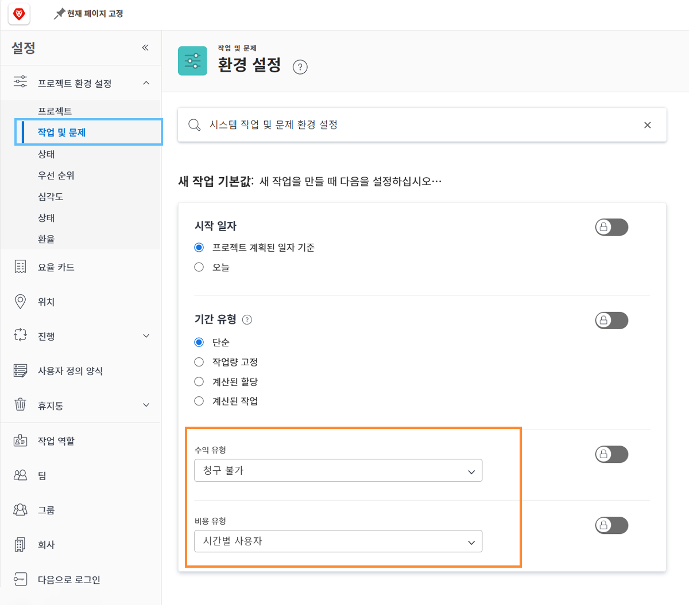

# 태스크 수익 및 원가 기본값 설정

수익 유형 및 원가 유형은 태스크에 대한 계획 및 실제 재무 정보를 계산하는 데 사용됩니다. 이러한 각 작업에 대한 기본 정보는 시스템 전체에 설정될 수 있으므로 새로 만든 각 작업에 적용됩니다. 개별 프로젝트에서 정보를 변경하거나 프로젝트 템플릿에서 설정할 수 있습니다.

**5가지 기본 매출 유형을 사용할 수 있습니다.**

* 청구 불가
* 시간별 사용자
* 시간별 역할
* 고정 시간별
* 고정 수입

**그리고 네 가지 기본 비용 유형을 사용할 수 있습니다.**

* 비용 없음
* 고정 시간별
* 시간별 사용자
* 시간별 역할

>[!NOTE]
>
>수익 또는 원가 유형을 청구 불가 또는 원가 없음으로 설정하면, 태스크에 대한 수익 및 원가 추정이 생성되지 않습니다. 따라서 작업에서는 프로젝트 수준의 수익이나 비용에 기여하지 않습니다.

## 수익 및 원가 기본값 설정

선택 **[!UICONTROL 설정]** 기본 메뉴에서 사용할 수 있습니다.

1. 클릭 **[!UICONTROL 프로젝트 환경 설정]** 왼쪽 패널 메뉴에서 를 클릭합니다.
1. 그런 다음 **[!UICONTROL 작업 및 문제]**.
1. 에서 [!UICONTROL 새 작업 기본값] 섹션에서 원하는 섹션을 선택합니다 [!UICONTROL 매출 유형] 및 [!UICONTROL 비용 유형].
1. 완료되면 저장 을 클릭합니다.

