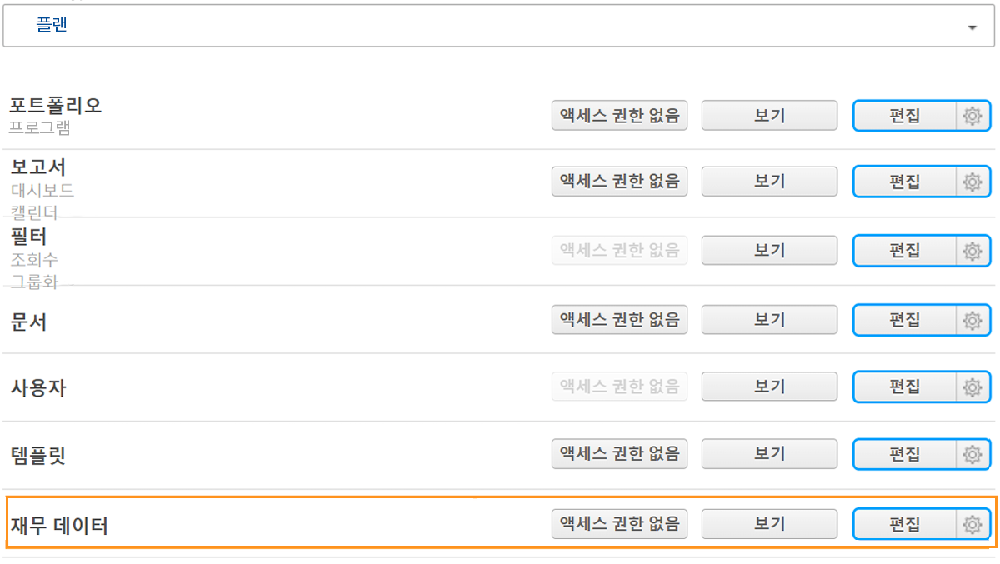
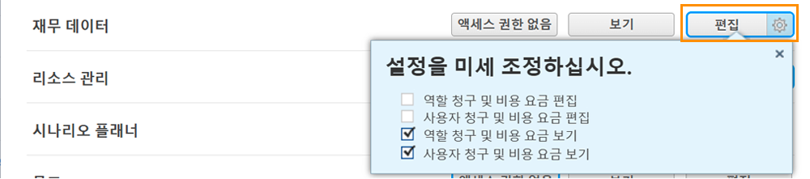

# 재무 액세스 이해

[!DNL Workfront]를 사용하여 재무 데이터를 캡처하는 경우, 시스템 관리자는 해당 정보를 조회하고 편집할 수 있는 권한을 가진 사용자를 보호하고 관리해야 합니다.

사용자가 재무 정보를 보거나 편집하려면 다음 두 가지가 필요합니다.

1. [!UICONTROL 액세스 수준]에서 액세스 권한을 활성화됨으로 설정해야 합니다.
2. 이러한 액세스 권한을 사용할 수 있는 권한은 오브젝트별로 부여되어야 합니다.

예를 들어 사용자에게 액세스 수준에서 재무 데이터를 볼 수 있는 권한이 부여될 수 있지만, 공유된 작업에 대한 재무 데이터만 볼 수 있으며 해당 작업 공유에서 재무 보기가 활성화됩니다.

따라서 [!UICONTROL 액세스 수준] 권한이 있는 사용자는 해당 오브젝트의 개별 공유 옵션에 따라 다른 오브젝트가 아닌 일부 오브젝트의 재무를 볼 수 있습니다. 단, [!UICONTROL 액세스 수준]에서 해당 오브젝트에 부여된 권한이 없는 경우에는 어떤 사용자도 해당 오브젝트에 대한 재무를 볼 수 없습니다

## [!UICONTROL 액세스 수준] 설정

전반적인 재무 데이터에 대한 액세스 권한은 [!DNL Workfront] 라이선스 유형별로 우선 부여됩니다.

**[!UICONTROL 플랜] 라이선스로는 다음이 가능합니다.**

* 과금 기록 관리
* 역할 과금 및 비용 요금의 관리 및 보기
* 사용자 과금 및 비용 요금의 관리 및 보기
* 경비 관리
* 재무 보기 및 편집

**[!UICONTROL 작업] 라이선스로는 다음이 가능합니다.**

* 경비 관리
* 재무 보기

**[!UICONTROL 검토] 라이선스로는 다음이 가능합니다.**

* 재무 보기

**[!UICONTROL 액세스 수준]에 따라 권한을 수정할 수 있습니다. 재무 데이터 액세스를 위한 세 가지 옵션은 다음과 같습니다.**

* [!UICONTROL 액세스 권한 없음] - 사용자는 재무 정보를 조회할 수 없습니다.
* [!UICONTROL 보기] - 사용자는 정보를 검토하고 공유할 수 있습니다.
* [!UICONTROL 편집] - 사용자는 정보를 생성, 수정, 삭제 및 공유할 수 있습니다. (플랜 라이선스에만 사용 가능)

[!UICONTROL 보기] 및 [!UICONTROL 편집] 옵션에는 [!UICONTROL 플랜] 라이선스에 대한 추가 설정이 있습니다. 다음 옵션에 대해 [!UICONTROL 보기] 버튼의 톱니바퀴를 클릭합니다.

**[!UICONTROL 보기]**

* 역할 과금 및 비용 요금 보기
* 사용자 과금 및 비용 요금 보기

**[!UICONTROL 편집]**

이 두 가지 옵션은 [!UICONTROL 편집] 옵션에서 다음과 함께 사용할 수 있습니다.

* 역할 과금 및 비용 요금 편집
* 사용자 과금 및 비용 요금 편집

>[!NOTE]
>
>경비를 추가할 수 있는 액세스 권한이 있는 사용자는 자신이 추가한 비용과 직속 부하 직원이 추가한 비용을 볼 수도 있습니다.
