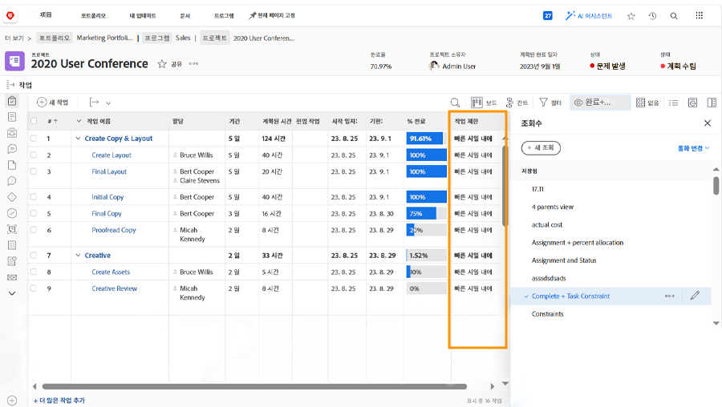

# 프로젝트 타임라인에서 진행 상황 추적

작업이 프로젝트 기한을 지켜야 하는 방식으로 진행되고 있는지 확인합니다. [!UICONTROL 작업] 목록을 스캔할 때 작업의 진행 상황 및 상태를 모니터링하는 데 도움이 되는 몇 가지 [!DNL  Workfront] 기능이 있습니다.

## 완료율

각 작업의 완료율은 때때로 작업 진행 상황을 측정하는 데 사용됩니다. 이 필드는 할당자의 진행 상황을 예측하기 때문에 수동으로 조정해야 함을 기억하십시오.

>[!TIP]
>
>작업 작업의 완료율은 수동으로 업데이트해야 하지만 상위 작업의 완료율은 완료율과 각 하위 작업의 기간 또는 계획된 시간을 기반으로 Workfront에서 계산됩니다. 따라서 대규모 작업을 더 작은 하위 작업으로 나누면 완료율 정확도가 더 높아집니다.

![[!UICONTROL 완료율] 열을 보여 주는 프로젝트 작업 목록](assets/planner-fund-task-percent-complete.png)

완료율이 자동으로 변경되는 경우는 다음 세 가지입니다.

* 작업 [!UICONTROL 상태]가 완료로 설정되면 완료율이 100으로 변경됩니다.
* 작업 [!UICONTROL 상태]가 새로 만들기로 롤백되면 완료율이 0으로 재설정됩니다.
* 하위 작업의 완료율이 변경되는 경우 상위 작업에서 완료율이 자동으로 변경됩니다.

## 상태

[!UICONTROL 보기]에 [!UICONTROL 상태] 열을 포함하면 시작된 작업, 진행 중인 작업 및 완료된 작업을 빠르게 확인할 수 있습니다. [!UICONTROL 보기]에 조건부 서식을 설정하여 각 상태를 색상 코드화하여 정보를 쉽게 해독할 수도 있습니다.

## 작업 할당

프로젝트를 검토할 때 작업 할당을 검토합니다. 작업에 할당된 사람이 없기 때문에 작업이 지연되었을 수 있습니다. 또는 할당된 사람이 작업을 완료하는 데 적합한 기술을 가지고 있지 않았을 수도 있습니다. 작업에 더 많은 사람을 추가하거나 작업을 재할당하여 작업이 완료되도록 합니다.

## 작업 제한 사항

때로는 작업 제한 사항이 변경되고 사용자가 이를 인식하지 못하는 경우가 있습니다. 제한 사항은 타임라인이 작동하는 방식에 영향을 미칠 수 있으므로, 원하는 방식으로 설정되었는지 확인해야 합니다.

[!UICONTROL 작업 제한 사항] 열이 포함된 사용자 정의 보기를 만들어 작업 목록에서 이 정보를 조회할 수 있습니다. 시작 일자부터 프로젝트를 계획한 경우, 작업에 [!UICONTROL 최대한 빨리] ([!UICONTROL ASAP]) 제한 사항이 적용되도록 합니다.

작업 제한 사항에 대한 자세한 내용은 [기간 유형 및 작업 제한 사항 이해 및 관리](https://experienceleague.adobe.com/docs/workfront-learn/tutorials-workfront/manage-work/intermediate-projects/understand-and-manage-duration-types-and-task-constraints.html)를 참조하십시오.
