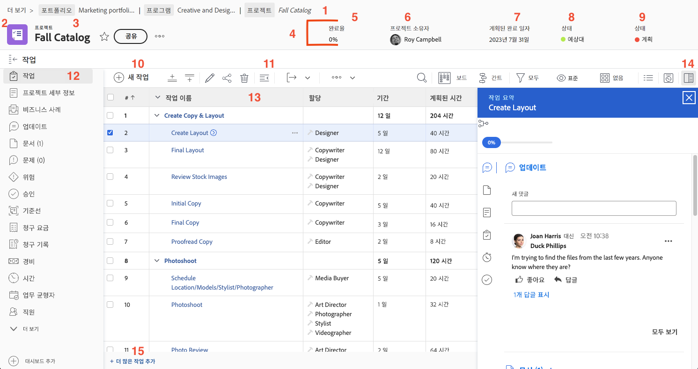

# 프로젝트 페이지 탐색

이 비디오에서는 Workfront의 프로젝트 페이지 탐색 및 관리에 대한 개요를 제공합니다. &#x200B; 주요 기능은 다음과 같습니다.

* **프로젝트 헤더:** 완료율, 프로젝트 관리자, 계획된 완료 일자, 프로젝트 상태 및 상태와 같은 필수 정보를 표시합니다. &#x200B; 상태는 프로젝트의 단계를 추적하고 알림을 트리거하는 데 도움이 됩니다. &#x200B;
* **탐색 표시 탐색:** 조직의 프로그램 및 포트폴리오에 있는 프로젝트의 배치를 쉽게 탐색할 수 있는 클릭 가능한 링크와 함께 표시합니다. &#x200B;
* **즐겨찾기 및 메뉴:** 즐겨찾기는 빠른 액세스를 위해 프로젝트에 책갈피를 지정하는 반면, 메뉴에서는 세부 정보 편집, 프로젝트 복사, 타임라인 다시 계산과 같은 옵션을 제공합니다. &#x200B;
* **작업 목록:** 프로젝트 계획의 단계를 나타냅니다. &#x200B; 빠른 필터를 사용하여 작업을 찾고, 빠른 변경을 위해 인라인 편집하고, 자세한 내용을 보려면 작업 요약 패널을 사용하십시오. &#x200B; 작업 이름을 클릭하면 전용 페이지가 열립니다. &#x200B;
* **왼쪽 패널:** 세부 정보, 업데이트 및 문서와 같은 다양한 프로젝트 섹션에 대한 액세스를 제공합니다. &#x200B; 패널은 시스템 관리자가 사용자 정의할 수 있습니다. &#x200B;
* **업데이트 섹션:**&#x200B;은(는) 프로젝트에 대한 커뮤니케이션을 중앙 집중화하여 사용자를 태그 지정하고, 댓글에 응답하고, 작업, 문제 및 문서에서 롤업된 업데이트를 볼 수 있도록 합니다. &#x200B;
* **문서 섹션:** 프로젝트 관련 파일 및 증명을 업로드하고 관리할 수 있습니다. &#x200B; 작업에 첨부된 문서는 쉽게 액세스할 수 있도록 프로젝트 수준으로 롤업됩니다. &#x200B;

>[!VIDEO](https://video.tv.adobe.com/v/3449733/?quality=12&learn=on&enablevpops=1&captions=kor)

## 핵심 사항

* **프로젝트 헤더 개요:** 완료율, 프로젝트 관리자, 기한, 상태, 조건 등 주요 프로젝트 세부 정보에 빠르게 액세스합니다. &#x200B; 또한 상태는 알림 및 워크플로 단계를 제어합니다. &#x200B;
* **작업 관리:** 작업 목록을 사용하여 프로젝트 단계를 추적하고 빠른 필터를 적용하여 작업을 찾고 인라인 편집을 수행합니다. &#x200B; 요약 패널 또는 작업 페이지를 통해 자세한 작업 정보에 액세스합니다. &#x200B;
* **이동 경로 탐색:** 이동 경로 추적에서 클릭 가능한 링크를 사용하여 조직 내에서 프로젝트 계층 구조를 탐색합니다. &#x200B;
* **중앙 업데이트:** 작업, 문제 및 문서의 모든 업데이트가 프로젝트 업데이트 섹션으로 롤업되어 통신 및 추적이 단순화됩니다. &#x200B;
* **문서 조직:** 문서 섹션에서 프로젝트 관련 파일 및 증명을 업로드하고 관리하여 원활한 공동 작업을 위해 관련 문서가 작업에 첨부되도록 합니다. &#x200B;

## 프로젝트 페이지의 주요 부분

이 페이지의 PDF를 다운로드하려면 [여기를 클릭](/help/assets/key-parts-of-the-project-page.pdf)하십시오.

프로젝트 페이지는 작업 관리에 도움이 되는 여러 기능으로 채워져 있습니다. [!DNL Workfront] 인스턴스에 표시되지 않는 필수 옵션이 있는 경우, 시스템 관리자와 함께 작업합니다. 다음은 주목해야 할 몇 가지 주요 프로젝트 페이지 기능입니다.

1. **이동 경로:** 프로젝트 뒤에 있는 프로그램 및 포트폴리오 계층을 탐색합니다.
2. **오브젝트 유형:** 랜딩 페이지에 오브젝트 유형이 표시되면 [!DNL Workfront]에서 보고 있는 항목을 확인할 수 있습니다. “프로젝트” 용어는 [!DNL Workfront] 시스템 관리자가 사용자 정의할 수 있습니다.
3. **프로젝트 이름:** 보고 있는 프로젝트의 이름입니다. 편집하려면 이름을 클릭합니다.
4. **프로젝트 헤더:** 모든 프로젝트 페이지에서 사용할 수 있는 표준 정보입니다.
5. **[!UICONTROL 완료율]:** 프로젝트에서 완료된 작업에 따라 자동으로 업데이트됩니다.
6. **[!UICONTROL 프로젝트 소유자]:** 대부분의 조직에서 프로젝트 관리자입니다. [!DNL Workfront]에서 프로젝트를 관리하고 완료를 담당하는 사람입니다.
7. **[!UICONTROL 계획된 완료 일자]:** 프로젝트의 계획 완료 일자는 프로젝트 타임라인을 통해 프로젝트 관리자가 설정합니다.
8. **[!UICONTROL 조건]:** [!UICONTROL 조건]은 프로젝트 진행 방식을 시각적으로 표시한 것입니다. [!DNL Workfront]는 프로젝트에서 작업의 진행 상태를 기반으로 [!UICONTROL 상태]를 자동 구성할 수 있습니다. 또는 [!UICONTROL 조건]은 프로젝트 세부 정보를 통해 수동 설정할 수 있습니다.
9. **[!UICONTROL 상태]:** [!UICONTROL 상태]는 프로젝트가 아직 계획 중인지, 진행 중인지, 프로젝트가 완료되었는지와 같은 프로젝트의 진행 상황을 나타냅니다.
10. **[!UICONTROL 새 작업]:** 프로젝트에서 작업을 만들려면 클릭합니다. 작업은 목록 하단에 생성됩니다.
11. **[!UICONTROL 내보내기]:** 작업 목록 또는 선택한 작업을 PDF, 스프레드시트 또는 탭으로 구분된 파일로 내보냅니다.
12. **왼쪽 패널 메뉴:** 왼쪽 패널에서 프로젝트에 대한 다른 정보로 이동합니다. 화면에 공간이 조금 더 필요한 경우, 상단의 작업 아이콘을 클릭하여 패널을 접으십시오. 순서가 효율적인 작업에 도움이 되도록 아이콘을 끌어서 놓습니다. 표시되는 옵션은 [!DNL Workfront] 시스템 관리자가 설정한 것입니다.
13. **작업 목록:** 작업 목록에는 프로젝트 계획을 구성하는 모든 작업이 표시됩니다. 각 작업에 대해 표시되는 정보는 선택한 보기에 따라 결정됩니다.
14. **요약 패널:** 요약 패널에서는 선택한 작업에 대한 정보를 빠르게 확인할 수 있습니다. 요약 패널 아이콘을 클릭하여 열거나 닫을 수 있습니다.
15. **더 많은 작업 추가** 인라인 편집을 사용하여 작업 목록 하단에 다른 작업을 추가하려면 여기를 클릭하십시오.

## 이 주제와 관련된 추천 튜토리얼

* [기본 프로젝트 생성 이해하기](/help/manage-work/projects/understand-basic-project-creation.md)
* [프로젝트를 생성하는 네 가지 방법에 대해 알아보기](/help/manage-work/projects/understand-other-ways-to-create-projects.md)
* [프로젝트 세부 정보 입력](/help/manage-work/projects/fill-in-the-project-details.md)

