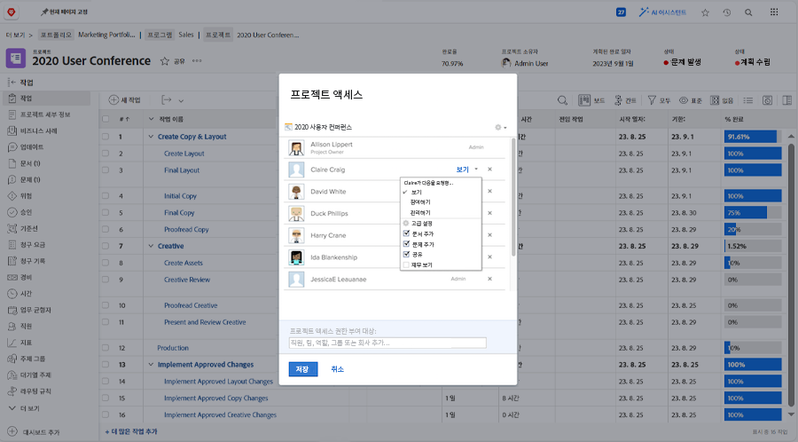

# 프로젝트 공유

프로젝트에 이해 당사자 및 협력자 가시성을 제공하는 것은 프로젝트 관리의 중요한 부분입니다.

프로젝트를 공유하여 모든 사람이 필요한 정보를 볼 수 있도록 하십시오. Workfront에서 이 작업은 [!UICONTROL 공유] 선택 사항입니다. 개별 프로젝트 또는 [!UICONTROL 자세히] 메뉴 아래의 제품에서 사용할 수 있습니다.

또는 의 프로젝트 목록에서 한 번에 여러 프로젝트를 공유할 수 있습니다 [!UICONTROL 프로젝트] 프로젝트를 선택하고 [!UICONTROL 공유] 버튼을 클릭합니다.

프로젝트를 공유하면 프로젝트 정보가 필요할 때 모든 사람이 볼 수 있습니다.

<!---
Learn More Icon
Share permissions on objects
Share a project
--->
