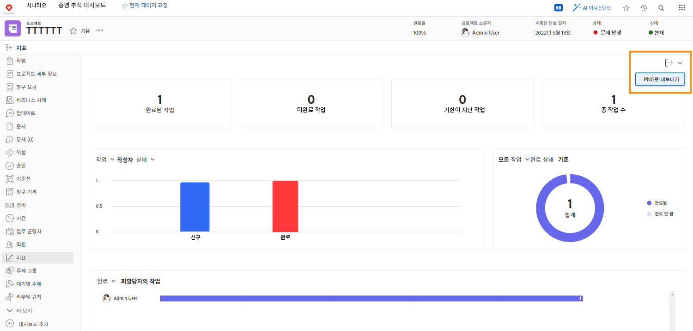

# 프로젝트 지표를 사용하여 작업 진행 추적

이 비디오에서는 다음 방법을 알아봅니다.

* 프로젝트 지표 차트 액세스
* 차트에서 정보 사용자 지정

>[!VIDEO](https://video.tv.adobe.com/v/336667/?quality=12)

를 사용하여 전체 프로젝트 지표 대시보드를 .png 파일로 내보낼 수 있습니다. [!UICONTROL 내보내기] 단추를 클릭합니다. 이렇게 하면 이메일이나 프레젠테이션을 통해 다른 사람과 데이터를 쉽게 공유할 수 있습니다.

<!---
Overview of project metrics
--->
